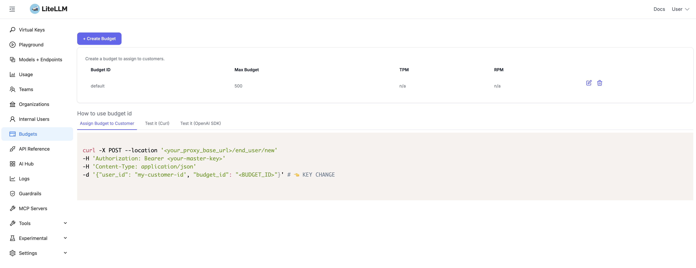
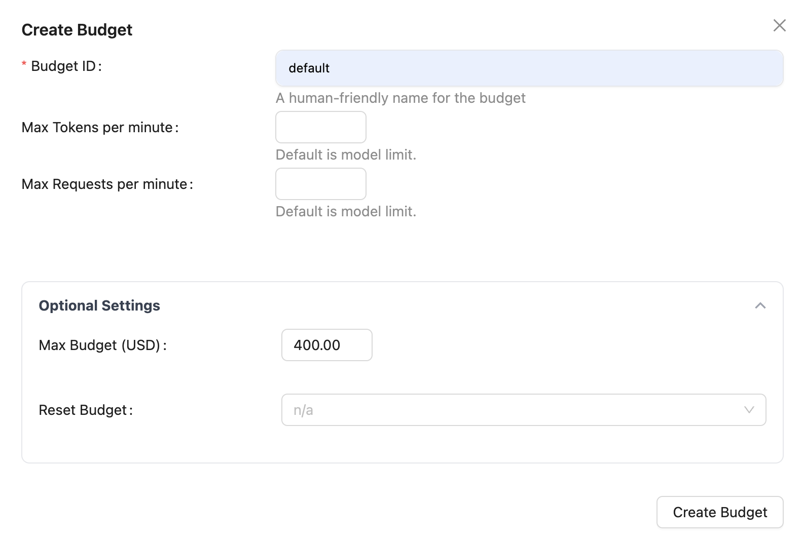

# LiteLLM Budget Configuration

LiteLLM allows you to set spending limits and rate limits through budgets. This guide explains how to create and configure budgets in the LiteLLM UI for CodeMie.

## Overview

Budgets in LiteLLM help you control costs and manage API usage by setting:

- **Max Budget**: Maximum spending limit in dollars
- **Max Tokens per Minute (TPM)**: Token rate limiting
- **Max Requests per Minute (RPM)**: Request rate limiting

### Budget Types

LiteLLM supports two types of budgets for different use cases:

#### 1. API Key Budget

This budget is assigned to the specific API key used to integrate CodeMie with LiteLLM.

**Recommended Configuration**: Set to **unlimited** to ensure CodeMie service is never interrupted at the integration level.

:::tip API Key Budget Best Practice
The API key budget should not be the primary cost control mechanism. Instead, use it as a safety net to prevent unexpected issues at the integration layer.
:::

#### 2. Default Budget (End User Budget)

This budget is assigned to individual CodeMie end users to control their spending. The CodeMie API automatically assigns this budget to each user when they make requests through the platform.

**Recommended Configuration**: Set **specific spending limits** to restrict how much each CodeMie user can spend on AI services.

:::info Cost Control Strategy
By setting the API key budget to unlimited and restricting each end user with a default budget, you ensure:

- CodeMie service remains available (no integration-level blocking)
- Individual users have controlled spending limits
- Easy cost management per user or team
  :::

## Accessing the LiteLLM UI

1. Navigate to your LiteLLM Proxy UI endpoint
2. Log in with your administrative credentials
3. From the left sidebar, click on **Budgets**



## Creating a Budget

### Step 1: Open Budget Creation Form

1. On the Budgets page, click the **+ Create Budget** button in the top-left corner
2. The "Create Budget" dialog will appear



### Step 2: Configure Budget Settings

Fill in the required and optional fields:

#### Budget ID (Required)

- **Field**: Budget ID
- **Description**: A human-friendly name for the budget
- **Example**: `default`, `team-budget`, `production-budget`

:::info Budget Naming
**Default Budget (End Users)**: AI/Run CodeMie uses the budget name `default` by default for end users. If you create a budget with a different name, you must configure the API to use it via environment variable.

**API Key Budget**: The budget name for the API Key has no specific naming pattern. You can use any descriptive name (e.g., `codemie-api-key`, `integration-budget`, `unlimited-api`).
:::

#### Rate Limiting (Optional)

Configure rate limits to control usage:

- **Max Tokens per Minute**: Limits the number of tokens processed per minute (default is model limit if not set)
- **Max Requests per Minute**: Limits the number of API requests per minute (default is model limit if not set)

### Step 3: Create the Budget

1. Review your configuration
2. Click the **Create Budget** button at the bottom-right of the dialog
3. Your budget will appear in the budgets list


## Default Budget Configuration

AI/Run CodeMie is pre-configured to use a budget named `default`. When you create this budget in LiteLLM:

1. Set **Budget ID** to: `default`
2. Configure your desired spending and rate limits
3. Save the budget

The CodeMie API will automatically use this budget for all requests.

## Using a Custom Budget Name

If you want to use a different budget name instead of `default`:

### Step 1: Create Your Custom Budget

1. Follow the budget creation steps above
2. Use your desired budget name (e.g., `production-budget`)

### Step 2: Configure CodeMie API

Update the CodeMie API deployment to reference your custom budget name:

**Environment Variable**:

```bash
LITELLM_BUDGET_ID=production-budget
```

**In Helm Values** (`values.yaml`):

```yaml
api:
  env:
    - name: LITELLM_BUDGET_ID
      value: "production-budget"
```

After updating the configuration, restart the CodeMie API pods for the changes to take effect.

## See Also

- [LiteLLM Proxy Installation Guide](../../../deployment/extensions/litellm-proxy/)
- [LiteLLM Model Configuration](../../../deployment/extensions/litellm-proxy/model-config)
- [API Configuration Reference](../../codemie/api-configuration)
