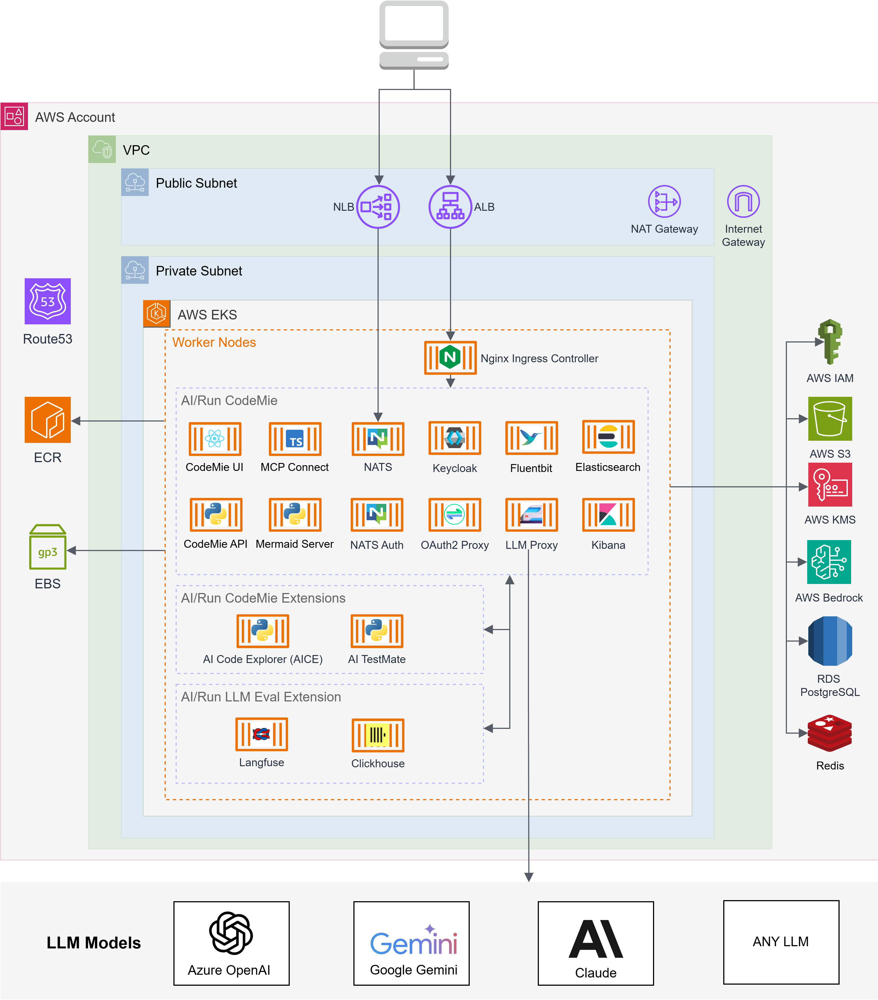

# AI/Run CodeMie Deployment Architecture

The diagram below depicts the AI/Run CodeMie infrastructure deployment in one region (AZ) of the AWS public cloud environment.

import ContainerResources from '../common/03-architecture/\_container-resources.mdx';

<ContainerResources />

## Infrastructure Components

The AI/Run CodeMie deployment on AWS includes the following main infrastructure components:

### Compute

- **Amazon EKS Cluster**: Managed Kubernetes service for running containerized applications
- **Auto Scaling Groups (ASG)**: Automatically adjusts compute capacity for the EKS cluster

### Networking

- **VPC**: Isolated network environment
- **Application Load Balancer (ALB)**: Distributes incoming HTTPS traffic to application services
- **Network Load Balancer (NLB)**: Handles TCP traffic for NATS messaging system
- **NAT Gateway**: Provides outbound internet connectivity for private subnets
- **Route 53**: DNS service with automatically provisioned records

### Storage

- **Amazon RDS PostgreSQL**: Managed relational database service
- **Amazon S3**: Object storage for application data and artifacts
- **EBS Volumes**: Persistent block storage for Kubernetes pods

### Security

- **AWS KMS**: Key Management Service for encrypting and decrypting sensitive data
- **IAM Roles**: Granular permissions for services and components
- **AWS Certificate Manager**: Automated SSL/TLS certificate management for ALB and NLB
- **Security Groups**: Network-level access control

### Optional Features

- **Internal ALB**: For private network communication when enabled
- **Private DNS Hosted Zone**: For internal service discovery
