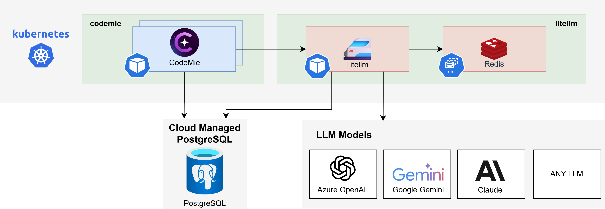

# LiteLLM Proxy Installation and Configuration Guide

This guide provides instructions for installing and configuring the LiteLLM Proxy, which serves as a unified gateway for our platform. It enables seamless connection to a diverse range of Large Language Models (LLMs) from providers like AWS Bedrock, Azure OpenAI, and Google Vertex AI. LiteLLM is the recommended solution for implementations that require support for multiple LLM providers or advanced features such as spend tracking and user-based budgeting.

## Prerequisites

### General Requirements

Before you begin, ensure you have:

- **Kubernetes Cluster Access**: `kubectl` configured to access your target cluster
- **Helm Charts Repository**: Clone access to [codemie-helm-charts](https://gitbud.epam.com/epm-cdme/codemie-helm-charts)
- **CodeMie Version**: AI/Run CodeMie v2.0.0 or higher

:::warning Version Requirement

LiteLLM Proxy requires AI/Run CodeMie version 2.0.0 or higher. Ensure your CodeMie installation is updated before proceeding.

:::

### Cloud Provider Prerequisites

Depending on which LLM providers you plan to use, prepare the appropriate credentials:

<strong>AWS Bedrock</strong>

Choose one of the following authentication methods:

- **Option 1 (Recommended for EKS): IAM Role with access to Bedrock services for use with IRSA (IAM Roles for Service Accounts)**

- **Option 2: AWS User with access to Bedrock services**

<strong>Azure OpenAI</strong>

Choose one of the following authentication methods:

- **Option 1 (Recommended): Azure Entra ID Application with access to Azure OpenAI services**

- **Option 2: Direct API key authentication**

<strong>Google Vertex AI</strong>

- **GCP Service Account with access to Vertex AI**

## LiteLLM Proxy System Requirements

The diagram below depicts the LiteLLM Proxy deployed on Kubernetes infrastructure within a cloud environment.

### Components and Requirements

| Component                  | CPU (Limits/Requests) | Memory (Limits/Requests) | Storage   |
| -------------------------- | --------------------- | ------------------------ | --------- |
| LiteLLM Proxy x 2 Replicas | 2 / 2 (1 / 1)         | 4Gi / 4Gi (2Gi / 2Gi)    | —         |
| Redis                      | 0.15 / 0.1            | 192Mi / 128Mi            | 2Gi       |
| PostgreSQL[^1]             | —                     | —                        | —         |
| **Total**                  | ~2.15 / ~2.1 vCPU     | ~4 / ~4 GiB RAM          | ~2 Gi PVC |

[^1]: Reusing main AI/Run CodeMie PostgreSQL instance

## Deployment Workflow

This guide provides a complete workflow for installing and integrating the LiteLLM Proxy. The process is divided into the following parts:

1. **[PostgreSQL Database Setup](./postgres-setup)** — Create a dedicated database and user for LiteLLM.
2. **[Configure API and Proxy Values](./configure-values)** — Configure the required `values.yaml` files for CodeMie and LiteLLM.
3. **[Cloud Provider Authentication](./auth-secrets)** — Configure credentials for AWS, Azure, and GCP.
4. **[LiteLLM Model Configuration](./model-config)** — Configure model lists and regions.
5. **[Deployment](./deployment)** — Install the LiteLLM Proxy using one of two methods:
   - Automated Deployment (Recommended)
   - Manual Deployment

For users migrating from the deprecated DIAL Proxy, see:

- **[Migration Guide from DIAL to LiteLLM](./migration-guide)**

## Next Steps

Follow the deployment workflow starting with [PostgreSQL Database Setup](./postgres-setup).
