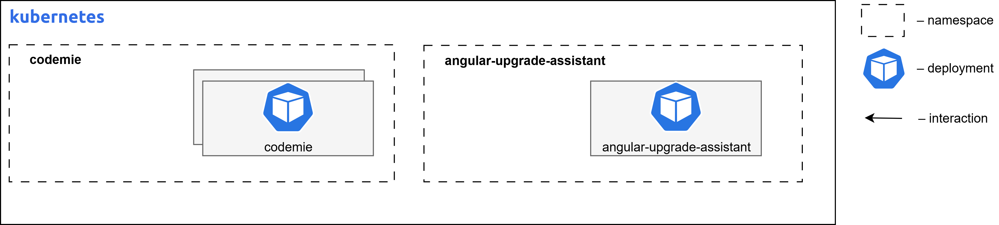

# Angular Upgrade Assistant

Angular Upgrade Assistant is an AI-enabled solution designed to streamline and simplify the process of upgrading Angular projects to newer Angular versions. Built with Vue.js and Vite, it provides an intuitive UI for managing dependency upgrades and fixing build errors.

## Use Case

When you need to upgrade an Angular project to a newer Angular version, this application provides a UI for the AI-enabled upgrade assistant, which speeds up and simplifies the process of upgrading project dependencies and fixing build errors.

## Angular Upgrade Assistant Requirements

The diagram below depicts the Angular Upgrade Assistant deployed on Kubernetes infrastructure within a cloud environment.



### Container Resource Requirements

| Component Name            | Replicas | Memory | CPU (cores) |
| ------------------------- | -------- | ------ | ----------- |
| angular-upgrade-assistant | 1        | 128Mi  | 0.1         |

### Component Overview

| Component name            | Images                                                                                      | Description                                                                                                                                                                                                                                                                        |
| ------------------------- | ------------------------------------------------------------------------------------------- | ---------------------------------------------------------------------------------------------------------------------------------------------------------------------------------------------------------------------------------------------------------------------------------- |
| angular-upgrade-assistant | `europe-west3-docker.pkg.dev/or2-msq-epmd-edp-anthos-t1iylu/prod/angular-upgrade-assistant` | Frontend UI application, part of Angular Upgrade AI Assistant solution to upgrade Angular projects to newer Angular versions. Built with Vue.js and Vite and based on CodeMie UI. Works together with Angular Upgrade AI Assistant server, which is a separate Python application. |

## Install Angular Upgrade Assistant Extension Component

Follow these steps to install the Angular Upgrade Assistant:

### Step 1: Configure Values File

Fill in missing values in `values.yaml` file in `codemie-helm-charts/codemie-extensions/angular-upgrade-assistant` by replacing `%%DOMAIN%%` with your domain name, e.g., `example.com`.

### Step 2: Install Helm Chart

Install the `angular-upgrade-assistant` Helm chart in the created namespace, applying the custom values file with the following command:

```bash
helm upgrade --install angular-upgrade-assistant oci://europe-west3-docker.pkg.dev/or2-msq-epmd-edp-anthos-t1iylu/helm-charts/angular-upgrade-assistant \
--version x.y.z \
--namespace "codemie" \
-f "./codemie-extensions/angular-upgrade-assistant/values-<cloud_name>.yaml" \
--wait --timeout 180s
```

### Step 3: Access the Application

AI/Run CodeMie UI can be accessed by the following URL:

- URL Pattern: `https://codemie.%%DOMAIN%%/apps/angular-upgrade-assistant/`
- Example: `https://codemie.example.com/apps/angular-upgrade-assistant/`

## Next Steps

- Return to [Extensions Overview](../)
- Configure other extensions
