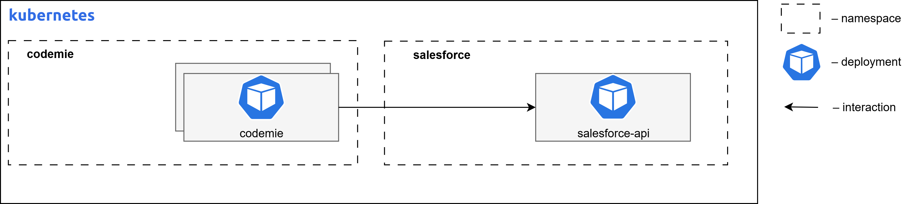

# Salesforce DevForce AI

Salesforce DevForce AI is an AI-powered development accelerator designed to streamline and enhance Salesforce development workflows. This extension provides intelligent assistance for Salesforce-related development tasks.

## Salesforce DevForce AI Requirements

The diagram below depicts the Salesforce DevForce AI deployed on Kubernetes infrastructure within a cloud environment.



### Container Resource Requirements

| Component Name         | Replicas | Memory | CPU (cores) |
| ---------------------- | -------- | ------ | ----------- |
| salesforce-accelerator | 1        | 256Mi  | 0.1         |

## Install Salesforce AI Extension Component

Follow these steps to install the Salesforce DevForce AI extension:

### Step 1: Configure Values File

Fill in missing values in `values.yaml` file in `codemie-helm-charts/codemie-extensions/salesforce-accelerator` by replacing `%%DOMAIN%%` with your domain name, e.g., `example.com`.

### Step 2: Install Helm Chart

Install the `salesforce-accelerator` Helm chart in the created namespace, applying the custom values file with the following command:

```bash
helm upgrade --install salesforce-accelerator oci://europe-west3-docker.pkg.dev/or2-msq-epmd-edp-anthos-t1iylu/helm-charts/salesforce-accelerator \
--version x.y.z \
--namespace "codemie" \
-f "./codemie-extensions/salesforce-accelerator/values-<cloud_name>.yaml" \
--wait --timeout 180s
```

### Step 3: Access the Application

AI/Run CodeMie UI can be accessed by the following URL:

- URL Pattern: `https://codemie.%%DOMAIN%%/salesforce-accelerator-api/`
- Example: `https://codemie.example.com/salesforce-accelerator-api/`

## Next Steps

- Return to [Extensions Overview](../)
- Configure other extensions
