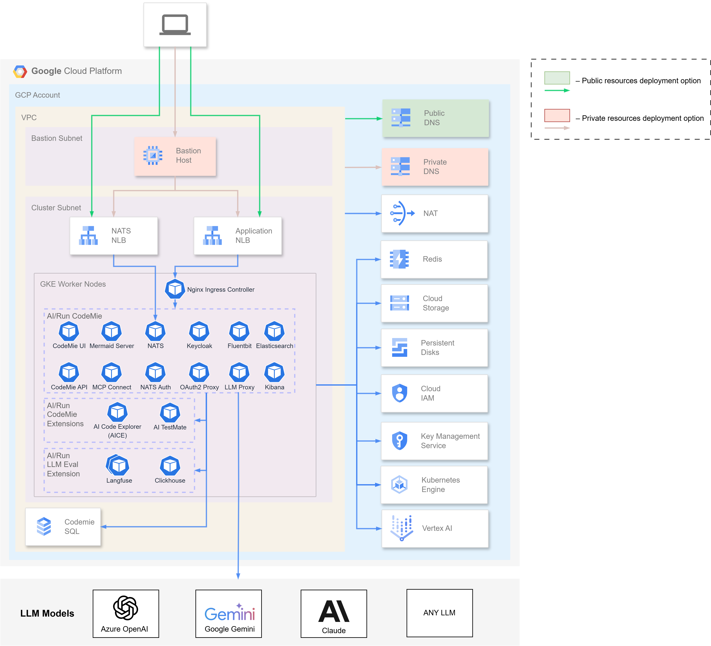

import ContainerResources from '../common/03-architecture/\_container-resources.mdx';

# AI/Run CodeMie Deployment Architecture

This page provides an overview of the AI/Run CodeMie deployment architecture on Google Cloud Platform (GCP), including infrastructure components, network design, and resource requirements.

## Architecture Overview

AI/Run CodeMie is deployed on Google Kubernetes Engine (GKE) with supporting GCP services for networking, storage, and identity management.

### Deployment Options

There are two deployment options available depending on your organization's access requirements:

- **Public cluster option** - Access to AI/Run CodeMie from predefined networks or IP addresses (VPN, corporate networks, etc.) using public DNS resolution from user workstations
- **Private cluster option** - Access to AI/Run CodeMie via Bastion host using private DNS resolution for enhanced security

### High-Level Architecture Diagram

The diagram below illustrates the complete AI/Run CodeMie infrastructure deployment on GCP:

:::tip Architecture Customization
The architecture can be customized based on your organization's security policies, compliance requirements, and operational preferences. Consult with your deployment team to discuss specific requirements.
:::

## Resource Requirements

<ContainerResources />

## Next Steps

After understanding the architecture, proceed to:

- [Infrastructure Deployment](./infrastructure-deployment) - Deploy the GCP infrastructure using Terraform
- [Components Deployment](./components-deployment) - Deploy AI/Run CodeMie application components using Helm
