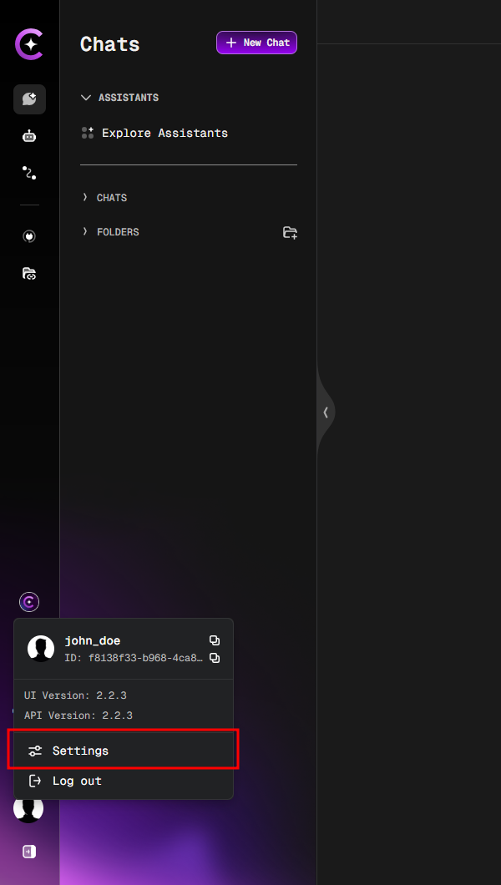
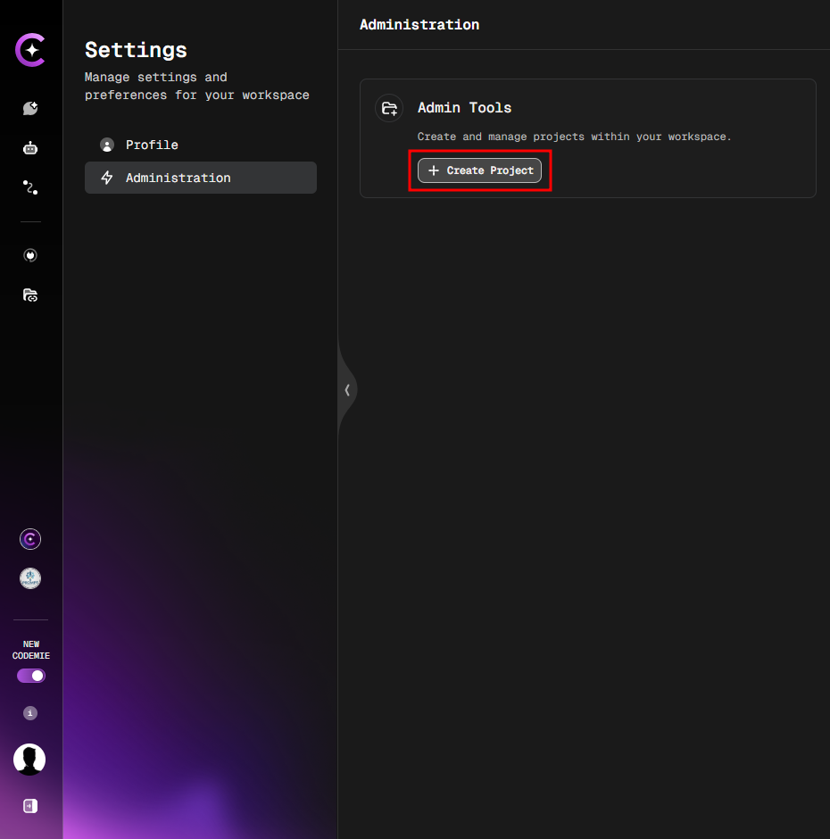
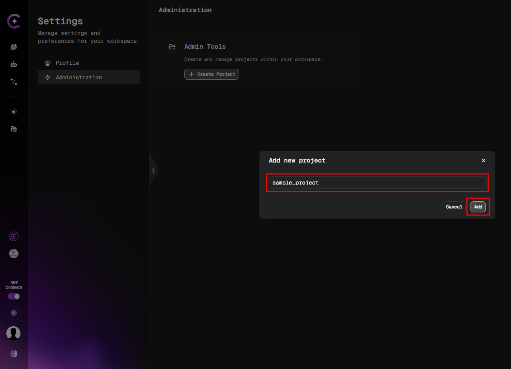

# Platform Administration Guide

This guide is for users who have been assigned the global `admin` role. It explains how to create new projects and access existing ones within the AI/Run CodeMie platform.

## Creating a New Project

Follow these steps to create a new project:

### 1. Open Settings

Click on your **Profile** icon in the bottom left corner and select **Settings**.

### 2. Navigate to Administration

In the Settings panel, click on the **Administration** tab.

### 3. Create a New Project

Click on the **Create Project** button.

### 4. Enter Project Details

Fill in a unique **Project Name** (e.g., `sample_project`) and click **Add**.

:::note Next Step
After creating the project, you can now assign it to users by following the instructions in [Step 2.2: Assign Attributes](./user-authorization/assign-attributes).
:::

## Accessing Existing Projects

:::note How Project Access Works for Admins
The project dropdown menu will initially appear empty for users with the `admin` role. To find and access any project, the administrator must start typing its name in the search bar (at least **three characters** are required).

_Example: The project dropdown is initially empty, but projects appear after typing "sam"._
:::

---

**Optional Convenience Tip:** For frequently used projects, you can optionally assign the `applications` attribute to an `admin` user. Any projects listed in this attribute will then appear in their dropdown by default, without needing to search. For more details, see [Step 2.2: Assign Attributes](./user-authorization/assign-attributes).
