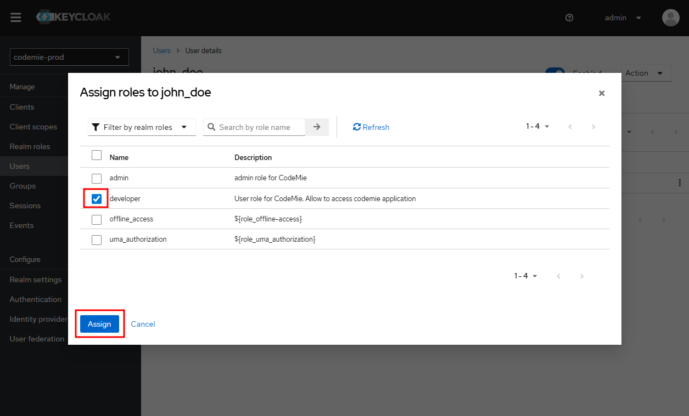

# Step 2.1: Assign Roles

Assigning a role is the first mandatory step in user authorization. A role defines the user's fundamental capabilities within the AI/Run CodeMie platform.

## Available Roles

| Role        | Permissions & Configuration                                                                                                                                                                                                                                                             |
| ----------- | --------------------------------------------------------------------------------------------------------------------------------------------------------------------------------------------------------------------------------------------------------------------------------------- |
| `admin`     | **Global Platform Administrator.**  This role grants the highest level of access and **does not require any additional attributes.**  Permissions include: • Managing **all** assistants on the platform • Creating projects • Creating global integrations |
| `developer` | **Base role for project-level access.**  This role **does nothing on its own**. It **always requires** at least one attribute (`applications` or `applications_admin`) to grant the user access to specific projects.                                                           |

## How to Assign a Role

Follow these steps to assign a role to a user in Keycloak:

### 1. Navigate to User Details

From the `User list` in the `codemie-prod` realm, click on the username of the user you want to configure.

### 2. Open Role Mappings

In the `User details` page, navigate to the `Role mappings` tab.

### 3. Assign Role

Click the `Assign role` button to open the role selection dialog.

### 4. Select and Confirm

1. Select the appropriate role (`admin` or `developer`)
2. Click the **Assign** button to confirm

### 5. Verify Assignment

After assignment, the role should appear in the user's role mappings list. The user now has the basic permission to sign into the platform.

## Next Steps

After assigning a role, the configuration path depends on which role you assigned:

- **For admin role users:** Configuration is complete. The user can now sign in with full platform access.
- **For developer role users:** You must continue to [Assign Attributes](./assign-attributes) to grant project access. Without attributes, users with the `developer` role cannot access any projects.
