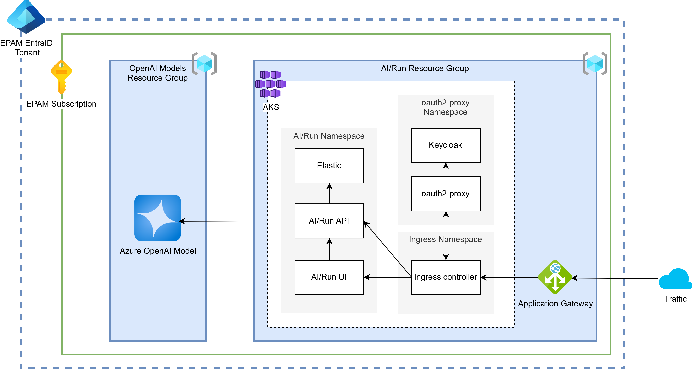

# AI/Run CodeMie Deployment Architecture

The diagram below depicts the AI/Run CodeMie infrastructure deployment in the Azure public cloud environment.

## EntraID Integration Options

import Tabs from '@theme/Tabs';
import TabItem from '@theme/TabItem';

<Tabs>
  <TabItem value="option1" label="Option 1" default>
    
  </TabItem>
  <TabItem value="option2" label="Option 2">
    
  </TabItem>
  <TabItem value="option3" label="Option 3">
    
  </TabItem>
</Tabs>

import ContainerResources from '../common/03-architecture/\_container-resources.mdx';

<ContainerResources />
