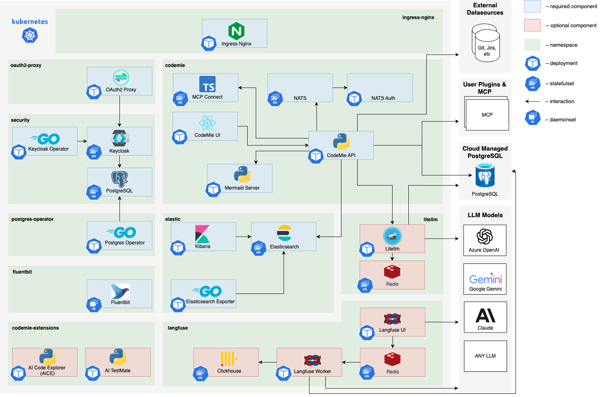

# AI/Run CodeMie Components Deployment

## Overview

This section describes the process of the main AI/Run CodeMie components deployment to the AKS cluster.

:::info
For infrastructure deployment details, refer to the [Infrastructure Deployment](./infrastructure-deployment) section
:::

## Prerequisites

1. Make sure you have obtained kubeconfig for AKS from previous section.
2. AKS cluster should have installed:
   1. Nginx Ingress Controller
   2. Azure Storage Class

:::info
If your AKS cluster does not already have an Nginx Ingress Controller and a Storage Class configured, don't worry. This guide and automated script includes detailed instructions for setting up both of these essential components in the appropriate sections that follow.
:::

3. Clone [codemie-helm-charts](https://gitbud.epam.com/epm-cdme/codemie-helm-charts) repository
4. For your convenience you can open repository in pre-installed VSCode:

```bash
cd codemie-helm-charts && code .
```

5. Before deploying AI/Run CodeMie components, you need to properly set up pull secret:

Ask AI/Run CodeMie team to provide `key.json` file and email of a service account to pull images from our container registry. Create `codemie` namespace:

```bash
kubectl create namespace codemie
```

Configure the secret in your cluster. Replace `%%PROJECT_NAME%%` with your project name:

```bash
kubectl create secret docker-registry gcp-artifact-registry \
  --docker-server=https://europe-west3-docker.pkg.dev \
  --docker-email=gsa-%%PROJECT_NAME%%-to-gcr@or2-msq-epmd-edp-anthos-t1iylu.iam.gserviceaccount.com \
  --docker-username=_json_key \
  --docker-password="$(cat key.json)" \
  -n codemie
```

Reference the secret in `codemie-ui`, `codemie-api`, `codemie-nats-auth-callout`, `codemie-mcp-connect-service` and `mermaid-server` deployments:

```yaml
imagePullSecrets:
  - name: gcp-artifact-registry
```

## AI/Run CodeMie Application Stack Overview



### Core AI/Run CodeMie Components

:::info
AI/Run CodeMie latest releases for core components versions can be found by executing following script in the [codemie-helm-charts](https://gitbud.epam.com/epm-cdme/codemie-helm-charts) repository for each component.

```bash
bash get-codemie-latest-release-version.sh
bash get-codemie-latest-release-version.sh -c ./path/to/key.json
```

Make sure you logged in with `key.json` shared with you.

:::info
Versions for Docker containers and Helm releases are matching
:::

| Component name                   | Images                                                                                              | Description                                                                                                                                                                                       |
| -------------------------------- | --------------------------------------------------------------------------------------------------- | ------------------------------------------------------------------------------------------------------------------------------------------------------------------------------------------------- |
| AI/Run CodeMie API               | `europe-west3-docker.pkg.dev/or2-msq-epmd-edp-anthos-t1iylu/prod/codemie:x.y.z`                     | The backend service of the AI/Run CodeMie application responsible for business logic, data processing, and API operations                                                                         |
| AI/Run CodeMie UI                | `europe-west3-docker.pkg.dev/or2-msq-epmd-edp-anthos-t1iylu/prod/codemie-ui:x.y.z`                  | The frontend service of the AI/Run CodeMie application that provides the user interface for interacting with the system                                                                           |
| AI/Run CodeMie Nats Auth Callout | `europe-west3-docker.pkg.dev/or2-msq-epmd-edp-anthos-t1iylu/prod/codemie-nats-auth-callout:x.y.z`   | Authorization component of AI/Run CodeMie Plugin Engine that handles authentication and authorization for the NATS messaging system                                                               |
| AI/Run CodeMie MCP Connect       | `europe-west3-docker.pkg.dev/or2-msq-epmd-edp-anthos-t1iylu/prod/codemie-mcp-connect-service:x.y.z` | A lightweight bridge tool that enables cloud-based AI services to communicate with local Model Context Protocol (MCP) servers via protocol translation while maintaining security and flexibility |
| AI/Run Mermaid Server            | `europe-west3-docker.pkg.dev/or2-msq-epmd-edp-anthos-t1iylu/prod/mermaid-server:x.y.z`              | Implementation of open-source service that generates image URLs for diagrams based on the provided Mermaid code for workflow visualization                                                        |

### Required Third-Party Components

| Component name               | Images                                                                                                                                 | Description                                                                                                                                                                                                      |
| ---------------------------- | -------------------------------------------------------------------------------------------------------------------------------------- | ---------------------------------------------------------------------------------------------------------------------------------------------------------------------------------------------------------------- |
| Ingress Nginx Controller     | `registry.k8s.io/ingress-nginx/controller:x.y.z`                                                                                       | Handles external traffic routing to services within the Kubernetes cluster. The AI/Run CodeMie application uses oauth2-proxy, which relies on the Ingress Nginx Controller for proper routing and access control |
| Storage Class                | –                                                                                                                                      | Provides persistent storage capabilities                                                                                                                                                                         |
| Elasticsearch                | `docker.elastic.co/elasticsearch/elasticsearch:x.y.z`                                                                                  | Database component that stores all AI/Run CodeMie data, including datasources, projects, and other application information                                                                                       |
| Kibana                       | `docker.elastic.co/kibana/kibana:x.y.z`                                                                                                | Web-based analytics and visualization platform that provides visualization of the data stored in Elasticsearch. Allows monitoring and analyzing AI/Run CodeMie data                                              |
| Postgres-operator            | `registry.developers.crunchydata.com/crunchydata/postgres-operator:x.y.z`                                                              | Manages PostgreSQL database instances required by other components in the stack. Handles database lifecycle operations                                                                                           |
| Keycloak-operator            | `epamedp/keycloak-operator:x.y.z`                                                                                                      | Manages Keycloak identity and access management instance and it's configuration                                                                                                                                  |
| Keycloak                     | `docker.io/busybox:x.y.z`, `quay.io/keycloak/keycloak:x.y.z`, `registry.developers.crunchydata.com/crunchydata/crunchy-postgres:x.y.z` | Identity and access management solution that provides authentication and authorization capabilities for integration with oauth2-proxy component                                                                  |
| Oauth2-Proxy                 | `quay.io/oauth2-proxy/oauth2-proxy:x.y.z`                                                                                              | Authentication middleware that provides secure authentication for the AI/Run CodeMie application by integrating with Keycloak or any other IdP                                                                   |
| NATS                         | `nats:x.y.z`, `natsio/nats-server-config-reloader:x.y.z`                                                                               | Message broker that serves as a crucial component of the AI/Run CodeMie Plugin Engine, facilitating communication between services                                                                               |
| LLM Proxy or EPAM DIAL Proxy | `docker.io/epam/ai-dial-core:x.y.z`, `docker.io/epam/ai-dial-adapter-openai:x.y.z`, `docker.io/bitnami/redis-cluster:x.y.z`            | Optional proxy component that balances requests to Azure OpenAI language models (LLMs), providing high availability and load distribution                                                                        |
| Fluentbit                    | `cr.fluentbit.io/fluent/fluent-bit:x.y.z`                                                                                              | Fluentbit enables logs and metrics collection from AI/Run CodeMie enabling the Agents observability                                                                                                              |

## Scripted AI/Run CodeMie Components Installation

The `helm-charts.sh` script (codemie-helm-charts repository) automates the deployment of components using Helm charts. It follows the steps described in the official documentation for deploying with Helm.

### Prerequisites

- Make sure AKS cluster has installed:
  - Nginx Ingress Controller
  - AKS Storage Class

:::info
Step-by-step installation examples are available in the "Nginx Ingress Controller" and "AKS Storage Class" subsections under the "Manual AI/Run CodeMie Components Installation" section.
:::

- Ensure you have [Helm](https://helm.sh/docs/intro/install/) installed and configured.
- Ensure that the required cloud provider CLI tools and credentials are set up (e.g., Azure CLI, Google Cloud SDK).
- The script assumes that you are familiar with basic Helm chart deployment and the underlying cloud environment.

### Script Parameters

The script requires exactly three input parameters to control its behavior:

1. **Cloud Provider**
   The target cloud provider where the deployment should be executed.
   **Allowed Values:**
   - `aws`
   - `azure`
   - `gcp`

2. **AI/Run Version**
   The version of the AI/Run components to deploy. Format should follow semantic versioning, for example:
   - `x.y.z`

3. **Mode Name**
   Specifies which components are to be installed.
   **Allowed Values:**
   - `all` - Installs both AI/Run components and the third-party components.
   - `recommended` - Installs both AI/Run components and the third-party components except of Nginx Ingress Controller
   - `minimal` - Installs only the AI/Run components.

### Component-specific placeholders

| Component    | Placeholder               | Description                | Example               | File to edit                                          |
| ------------ | ------------------------- | -------------------------- | --------------------- | ----------------------------------------------------- |
| Kibana       | `codemie.private.lab.com` | Your public/private host   | `codemie.example.com` | `codemie-helm-charts/kibana/values-azure.yaml`        |
| Keycloak     | `codemie.private.lab.com` | Your public/private host   | `codemie.example.com` | `codemie-helm-charts/keycloak-helm/values-azure.yaml` |
| OAuth2 Proxy | `codemie.private.lab.com` | Your public/private host   | `codemie.example.com` | `codemie-helm-charts/oauth2-proxy/values-azure.yaml`  |
| CodeMie UI   | `codemie.private.lab.com` | Your public/private host   | `codemie.example.com` | `codemie-helm-charts/codemie-ui/values-azure.yaml`    |
| CodeMie API  | `codemie.private.lab.com` | Your public/private host   | `codemie.example.com` | `codemie-helm-charts/codemie-api/values-azure.yaml`   |
| CodeMie API  | `%%DOMAIN%%`              | Your public/private domain | `example.com`         | `codemie-helm-charts/codemie-api/values-azure.yaml`   |

### Usage

Below is example demonstrating how to run the script:

**Example: Deploy AI/Run CodeMie + Third-Party Components**

```bash
export GOOGLE_APPLICATION_CREDENTIALS=key.json
gcloud auth application-default print-access-token | helm registry login -u oauth2accesstoken --password-stdin https://europe-west3-docker.pkg.dev

bash helm-charts.sh --cloud azure --version x.y.z --mode all
```

## Finalizing Installation and Accessing Applications

Regardless of your installation method, eventually you should have the following application stack available:

| Component          | URL                                                    |
| ------------------ | ------------------------------------------------------ |
| AI/Run CodeMie UI  | `http://codemie.private.lab.com`                       |
| AI/Run CodeMie API | `http://codemie.private.lab.com/code-assistant-api/v1` |
| Keycloak UI        | `http://codemie.private.lab.com/keycloak/admin`        |
| Kibana             | `http://codemie.private.lab.com/kibana`                |

:::info
Some components maybe missing due to your setup configuration or use `http` protocol in private cluster.
:::

For detailed manual installation steps for each component, please refer to the [codemie-helm-charts](https://gitbud.epam.com/epm-cdme/codemie-helm-charts) repository documentation.
