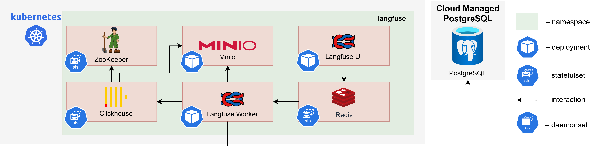

# Langfuse System Requirements

The diagram below depicts the Langfuse LLM Observability Platform deployed on Kubernetes infrastructure within a cloud environment.

## Components and Requirements

| Component               | CPU (Limits/Requests) | Memory (Limits/Requests) | Storage         |
| ----------------------- | --------------------- | ------------------------ | --------------- |
| Langfuse Web            | 2 / 1                 | 4Gi / 2Gi                | —               |
| Langfuse Worker         | 2 / 1                 | 4Gi / 2Gi                | —               |
| PostgreSQL[^1]          | —                     | —                        | —               |
| ClickHouse x 3 Replicas | 2 / 0.3               | 8Gi / 8Gi                | 100Gi PVC       |
| Zookeeper x 3 Replicas  | 2 / 0.1               | 4Gi / 4Gi                | 1Gi             |
| Redis                   | 1 / 0.1               | 1.5Gi / 512Mi            | 2Gi             |
| S3 (Minio)[^2]          | 2 / 0.1               | 4Gi / 512Mi              | 100Gi PVC       |
| **Total**               | **~11 / ~2.6 vCPU**   | **~49.5 / ~33 GiB RAM**  | **~400 Gi PVC** |

[^1]: Reusing main AI/Run CodeMie PostgreSQL instance

[^2]: Can use S3 instead of MinIO
