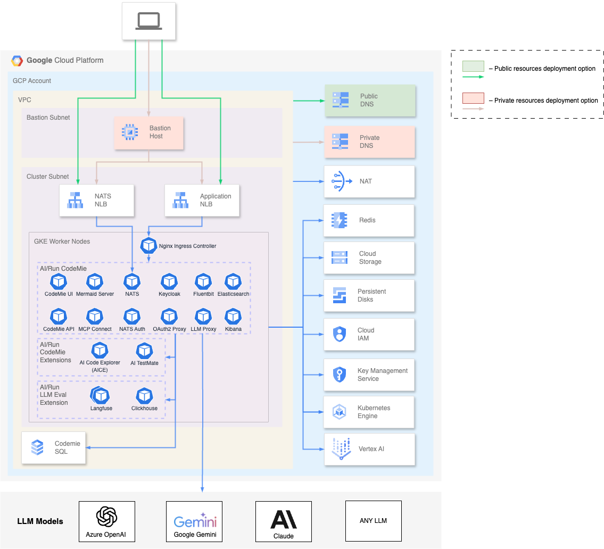

# AI/Run CodeMie Deployment Architecture

The diagrams below depict the AI/Run CodeMie infrastructure deployment in one region of the GCP public cloud environment. There are two deployment options available:

- **Public cluster option** with access to AI/Run CodeMie from predefined networks or IP addresses (VPN, etc) on public DNS from user workstation
- **Private cluster option** with access to AI/Run CodeMie via Bastion host on private DNS

## Container Resources Requirements

| Component           | Pods                     | RAM   | vCPU | Storage            |
| ------------------- | ------------------------ | ----- | ---- | ------------------ |
| CodeMie API         | 2                        | 8Gi   | 4.0  | –                  |
| CodeMie UI          | 1                        | 128Mi | 0.1  | –                  |
| Elasticsearch       | 2                        | 16Gi  | 4.0  | 100-200 Gb per pod |
| Kibana              | 1                        | 1Gi   | 1.0  | –                  |
| Mermaid-server      | 1                        | 512Mi | 1.0  | –                  |
| PostgreSQL          | Managed service in cloud |       |      | 30-50 Gb           |
| Keycloak + DB       | 1 + 1                    | 4Gi   | 2.0  | 1 Gb               |
| Oauth2-proxy        | 1                        | 128Mi | 0.1  | –                  |
| NATS + Auth Callout | 1 + 1                    | 512Mi | 1.0  | –                  |
| MCP Connect         | 1                        | 1Gi   | 0.5  | –                  |
| Fluent Bit          | daemonset                | 128Mi | 0.1  | –                  |
| LLM Proxy\*         | 1                        | 1Gi   | 1.0  | –                  |

\* Depends on the exact LLM proxy type
