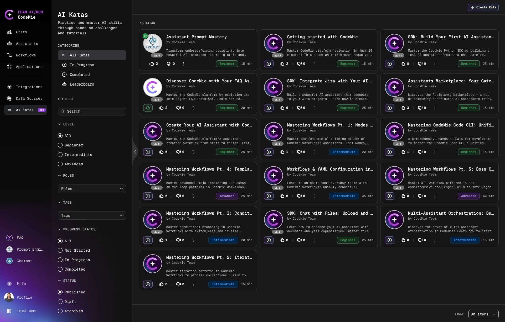

# AI Katas Overview

AI Katas is a learning platform offering structured exercises designed to help you practice and master CodeMie skills through practical challenges and step-by-step tutorials. Each Kata is a guided learning exercise covering specific topics or technologies within CodeMie.

## Getting Started

1. Navigate to **AI Katas** in the left sidebar
2. Browse the catalog or use filters to find topics that interest you
3. Click on a Kata to view full details
4. Follow the step-by-step instructions to complete the exercise
5. Track your progress and ranking on the leaderboard

## Next Steps

- Learn [how to work with Katas](./working-with-katas) - browse, filter, and complete exercises
- Check the [Leaderboard](./leaderboard) to track your ranking
- For admins: [Manage Katas](./manage-katas-admin)
