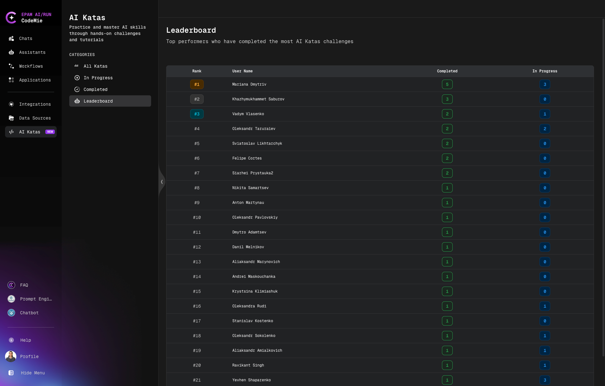

# Leaderboard

Track your ranking and compete with other users on the AI Katas leaderboard.

## Overview

The Leaderboard feature allows you to:

- **Compare Rankings**: See how you rank against other platform users
- **Track Performance**: Monitor your position over time
- **Community Engagement**: Engage with the learning community
- **Stay Motivated**: Friendly competition to encourage continuous learning

## Accessing the Leaderboard

1. Navigate to the **AI Katas** section
2. Click on **Leaderboard** in the Categories filter panel on the left
3. View current rankings and statistics

## How Rankings Work

Your ranking is based on:

- **Number of Completed Katas**: More completed exercises improve your rank
- **Difficulty Levels**: Advanced Katas contribute more to your score than Beginner ones
- **Completion Quality**: Completing exercises thoroughly affects your ranking
- **Community Contributions**: Feedback and engagement with the community

## Leaderboard Features

- **Top Performers**: View leading users and their achievements
- **Your Ranking**: Quickly find your current position
- **Progress Indicators**: Track improvements in your ranking over time
- **User Statistics**: See completed Katas count for each user

## Improving Your Rank

To improve your leaderboard position:

1. **Complete More Katas**: Focus on finishing exercises you've started
2. **Challenge Yourself**: Try progressively harder difficulty levels
3. **Maintain Consistency**: Regular completion is better than occasional bursts
4. **Quality Over Speed**: Thorough completion is more valuable than rushing

:::tip Focus on Learning
While the leaderboard provides motivation, prioritize quality learning over ranking. The best way to improve your position is to genuinely master the skills taught in each Kata.
:::
