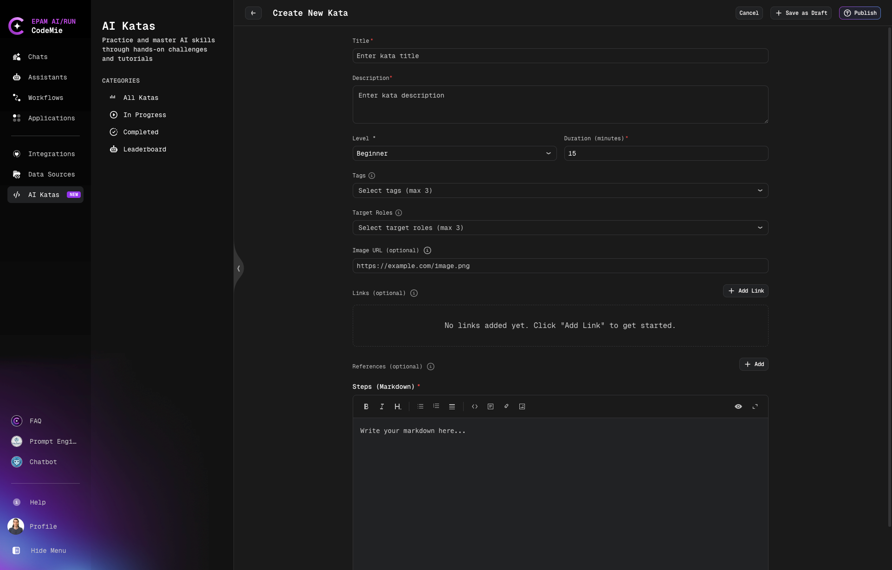

# Manage Katas

Create, edit, publish, clone, and archive AI Katas.

:::warning Access Required
This functionality is only available to users with the [isAdmin](/user-guide/getting-started/glossary#jwt-attributes) role or [Project Admin](/user-guide/getting-started/glossary#project-admin) permissions. Platform Administrators and Project Admins have full access to create, edit, publish, and manage all Kata content.
:::

## Creating a Kata

1. Navigate to **AI Katas**
2. Click **+ Create Kata**
3. Fill in the creation form



### Required Fields

| Field                     | Description                                        |
| ------------------------- | -------------------------------------------------- |
| **Title** \*              | Clear, descriptive name (50-70 characters)         |
| **Description** \*        | Detailed learning objectives and outcomes          |
| **Level** \*              | Beginner / Intermediate / Advanced                 |
| **Duration (minutes)** \* | Estimated completion time                          |
| **Steps (Markdown)** \*   | Step-by-step instructions with markdown formatting |

### Optional Fields

| Field            | Description                                        |
| ---------------- | -------------------------------------------------- |
| **Tags**         | Up to 3 topic tags (e.g., `getting-started`)       |
| **Target Roles** | Up to 3 professional roles (e.g., `developer`)     |
| **Image URL**    | HTTPS URL to Kata card image (400x300 - 800x600px) |
| **Links**        | Reference materials and documentation              |
| **References**   | Additional reading materials                       |

### Writing Effective Steps

Use markdown editor features:

- **Headers**: Organize content with `##` and `###`
- **Lists**: Numbered or bulleted lists
- **Code Blocks**: Syntax highlighting for code examples
- **Images**: Embed screenshots using markdown
- **Links**: Reference external resources

**Example Structure:**

```markdown
### Instructions

1. **Open an existing assistant** in your workspace that you'd like to improve:
   - Navigate to your assistants list
   - Choose an assistant that hasn't been performing as expected or has poor prompt
   - Or create a new assistant if you want to start fresh

2. **Access the edit page**:
   - Go on the assistant's edit page
   - Locate the **System Instructions** section (this is your assistant's prompt)

3. **Launch Refine with AI**:
   - Find the **"Refine with AI"** action button above the System Instructions section
   - Click it to open the refinement dialog
```

## Publishing and Status

### Save as Draft

- Save without publishing
- Only visible to admins and authorized editors
- Use for review and refinement

### Publish

- Make Kata available to all users
- Requires all required fields to be completed
- Kata appears in the public catalog

### Cancel

- Discard changes and exit
- Unsaved changes will be lost

## Editing Katas

1. Open the Kata details page
2. Click the **Edit** button
3. Modify fields
4. Save as draft or publish changes

:::tip
Test all steps yourself before publishing to ensure instructions work correctly.
:::

## Cloning Katas

1. Open the Kata to copy
2. Click **Clone**
3. Modify title, description, and steps
4. Save as draft or publish

Use cloning to create variations or customize content for different audiences.

## Archiving Katas

:::note
Katas cannot be permanently deleted - they can only be archived. Archived Katas can be cloned at any time to create new versions.
:::

To archive a Kata:

1. Open the Kata details page
2. Click **Archive**
3. Confirm the action

Archived Katas are removed from the public catalog but remain accessible to administrators. You can clone archived Katas to restore or modify content.

## Best Practices

- **Test Before Publishing**: Complete each Kata yourself
- **Clear Instructions**: Write for your target audience's skill level
- **Update Regularly**: Keep content current with platform changes
- **Monitor Feedback**: Review likes/dislikes and improve low-rated Katas
- **Consistent Style**: Maintain uniform formatting across Katas
