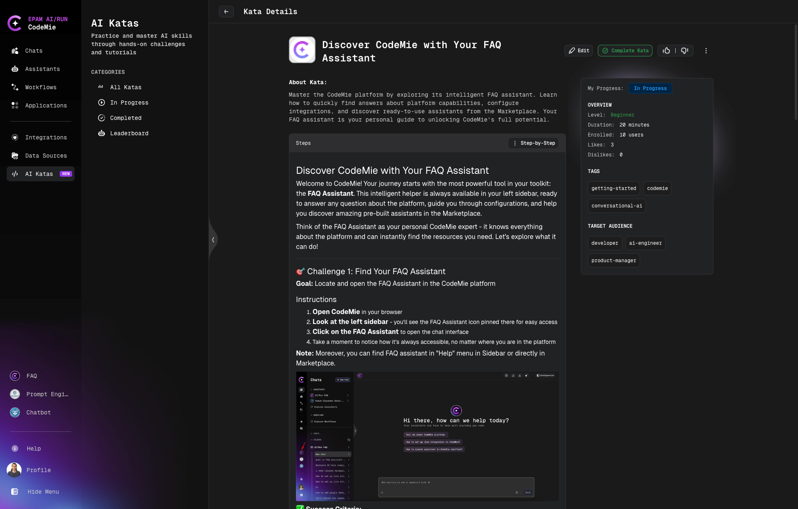
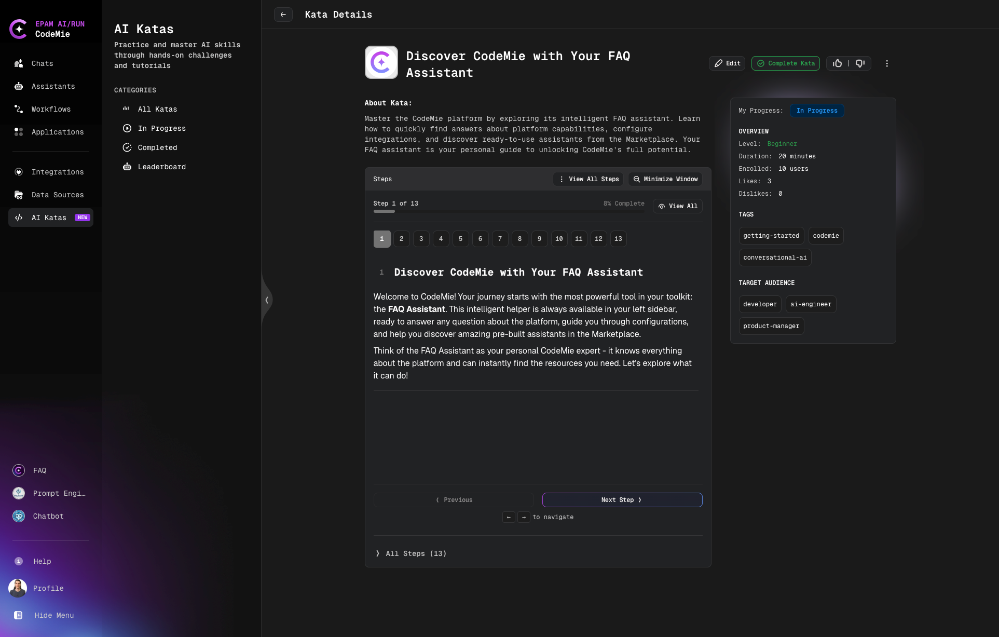
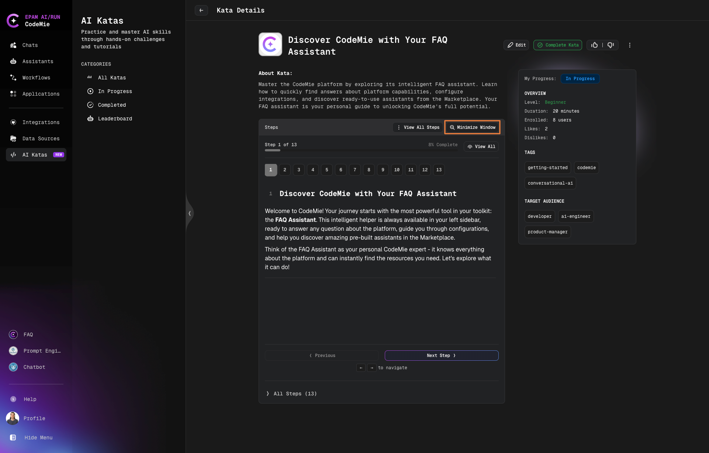
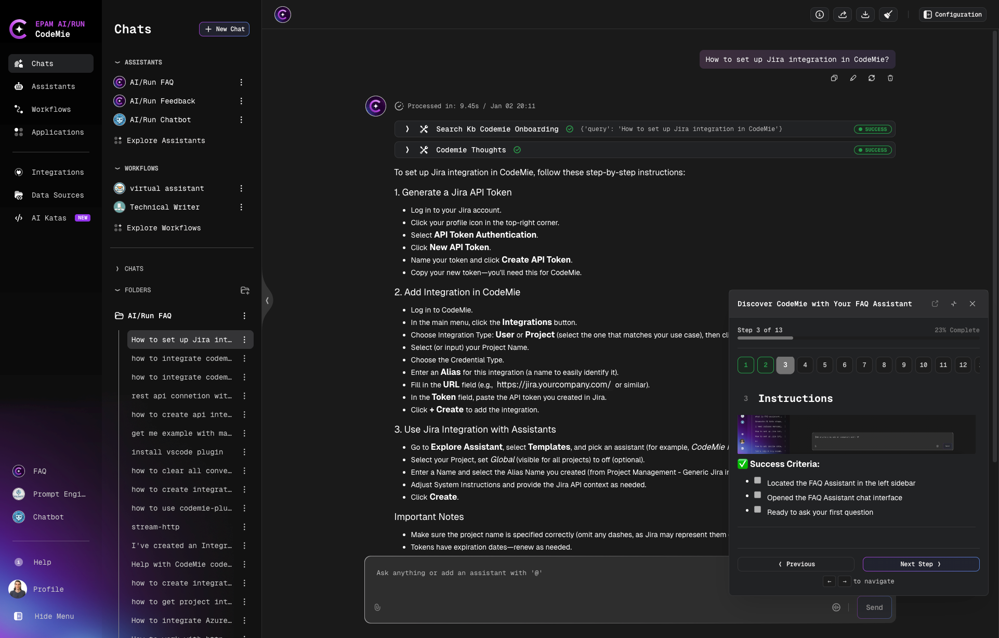

# Working with AI Katas

## Browsing the Catalog

Each Kata card displays title, difficulty level, duration, progress status, enrolled users count, and feedback.

## Filtering Katas

| Filter Type         | Options                                           | Description                                                 |
| ------------------- | ------------------------------------------------- | ----------------------------------------------------------- |
| **Categories**      | All Katas / In Progress / Completed / Leaderboard | Quick access to catalog views and rankings                  |
| **Level**           | All / Beginner / Intermediate / Advanced          | Filter by difficulty                                        |
| **Roles**           | Developer / AI Engineer / Product Manager / etc.  | Filter by target professional role                          |
| **Tags**            | Topic or technology tags                          | Filter by topics (max 3 selections)                         |
| **Progress Status** | All / Not Started / In Progress / Completed       | Track your learning progress                                |
| **Status**          | Published / Draft / Archived                      | Filter by publication status (Draft visible to admins only) |
| **Search**          | Keyword or topic                                  | Find specific Katas by search term                          |

:::tip
All filter preferences are automatically saved.
:::

## Viewing Modes

You can work with Katas in three different modes:

### 1. Details Mode (Default)

View Kata information and scroll through all steps in a standard details view.

### 2. Step-by-Step Mode

Complete one step at a time with progress indicators and Previous/Next navigation. Click **Step-by-Step** button to enable this mode.

### 3. Minimized Mode

Collapse the Kata into a small floating window with navigation controls. This allows you to view Kata instructions and complete tasks simultaneously in other platform sections.

## Progress Tracking

- Progress automatically saved in real-time
- Status: Not Started / In Progress / Completed
- Persists across browser sessions

## Completing a Kata

1. Work through all steps
2. Click **Complete Kata** button
3. Provide feedback (optional)

## Providing Feedback

Rate Katas with like/dislike to help improve content quality. Your vote is anonymous and can be changed anytime.
