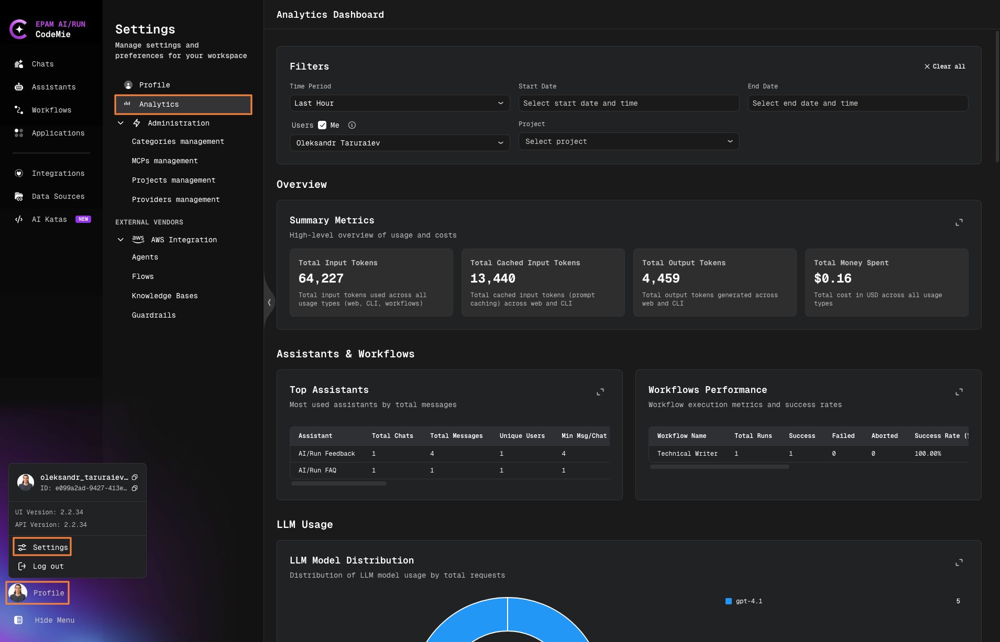

# Analytics Dashboard

The Analytics Dashboard provides comprehensive monitoring and management of LLM usage, costs, and activity metrics across the CodeMie platform. Access real-time insights into token consumption, spending patterns, and system utilization with flexible filtering and dual visualization modes.

## Accessing the Analytics Dashboard

To access the Analytics Dashboard, follow these steps:

1. Click on your **Profile icon** in the bottom left corner of the screen
2. Select **Settings** from the profile menu
3. Click on **Analytics** in the Settings navigation menu

The Analytics Dashboard will open, displaying comprehensive monitoring and management tools for LLM usage, costs, and activity metrics.

## Access Permissions and Data Visibility

The Analytics Dashboard data visibility depends on your user role and permissions defined in [JWT attributes](../getting-started/glossary#jwt-attributes):

### Regular Users

Regular users without admin privileges:

- View only **personal statistics** (your own usage and costs)
- Access data related to your individual activity
- Monitor your own assistants, workflows, and tool usage

### Admin Role (isAdmin)

Users with the `isAdmin` role have full access to analytics data across the entire CodeMie platform:

- View statistics for **all projects** in the organization
- View statistics for **all users** using CodeMie
- Access complete platform-wide usage and cost metrics
- Monitor all assistants, workflows, tools, and integrations

### Project Admin Role (applications_admin)

Users with `applications_admin` permissions have limited access to analytics data:

- View statistics only for **projects where you are a Project Admin**
- View data for **all users** within your managed projects
- Monitor usage and costs specific to your projects
- Access project-level metrics for assistants and workflows

:::info
To view analytics for projects or other users, you need either the `isAdmin` role or `applications_admin` permissions for specific projects. Contact your administrator if you need broader access to analytics data.
:::

## Global Filtering System

The Analytics Dashboard features a powerful filtering system that allows you to narrow down data across all dashboard sections simultaneously.

### Available Filters

**Time Period Filter**

- **Presets**: Quick selection options
  - Last Hour
  - Last N Hours (customizable)
  - Last N Days (customizable)
  - Last Month
- **Custom Range**: Select specific start and end dates with time
  - Start Date: Choose date and time
  - End Date: Choose date and time

**User Filter**

- Multi-select dropdown with autocomplete
- Filter by specific users or select "Me" to view your own activity
- Combine multiple users for comparison

**Project Filter**

- Multi-select dropdown with autocomplete
- Filter analytics by specific projects
- View project-specific usage and costs

### Filter Behavior

- **Combined Filtering**: All active filters work together to refine data
- **Persistent Selections**: Filter choices remain active as you navigate between dashboard sections
- **Clear All**: Reset all filters with a single action using the "Clear all" button
