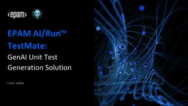

# AI TestMate

AI TestMate is an autonomous GenAI solution for automatic unit-test generation that works as a "virtual teammate" within the SDLC: it analyzes repositories, creates and commits tests without manual intervention, helping quickly increase coverage and reduce team effort. It uses an ensemble of LLM models, an agentic approach, and a secure proxy access layer to the models.

:::info
Learn more: [AI TestMate Documentation](https://codemie.lab.epam.com/aitestmate/docs/)
:::
