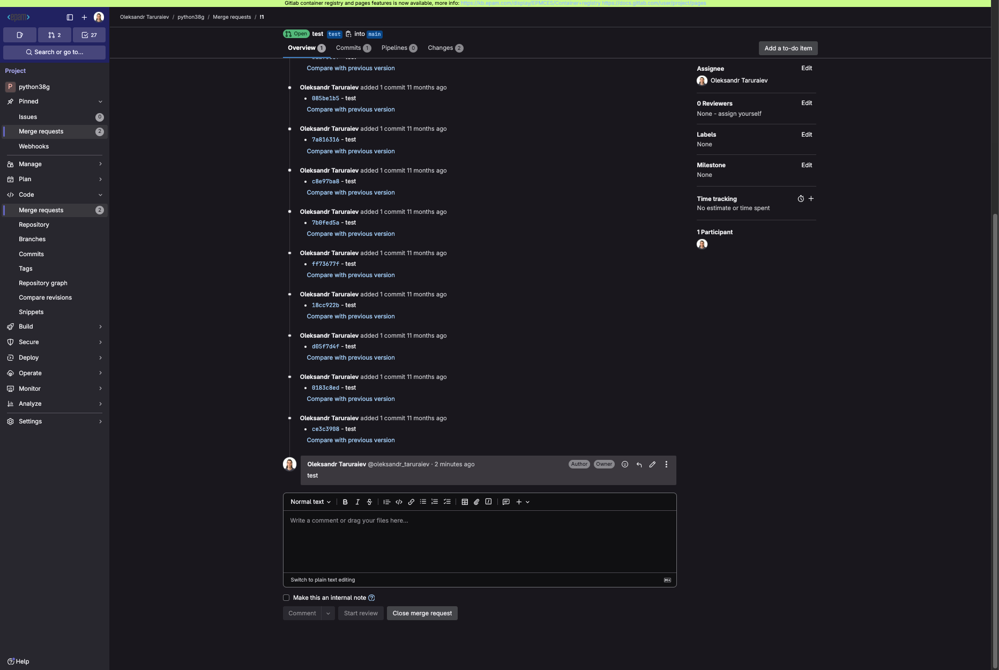

# 3.10 Group Chats

Sometimes it might be annoying to scroll and search the exact chat with the exact assistant to ask a single question. Alternatively, spawning new chats will lead to an excessive number of tiny chats that are basically not so important to store so you will need to manually delete them from time to time. To address these problems, group chats were created.

Group chat is the chat that is not linked to a concrete assistant. These chats are designed to enhance user experience by enabling them to communicate with all the available assistants through a single chat interface, without the need to switch between chats. This feature introduces a more streamlined way of interacting with different assistants by using the "@slug" method for task delegation.

Users will benefit from a simplified chat experience, allowing them to efficiently delegate tasks to specific assistants within a unified chat interface. This eliminates the need to switch contexts or reiterate instructions when moving between different assistants.

Each assistant in the chat will be using this model to process your request. If you don't specify a concrete model, it will be using the model that was originally specified in the assistant's configuration.

## Using Group Chats

1. The first message in the chat must always contain an assistant's tag. To specify the assistant's tag, type the **@** symbol and select the assistant you want to address:

2. Ask a question:

All the further questions will be addressed to the assistant you tagged. To change the assistant, tag another one using the **@** symbol. The assistant's portrait will be indicating that another assistant is used.
