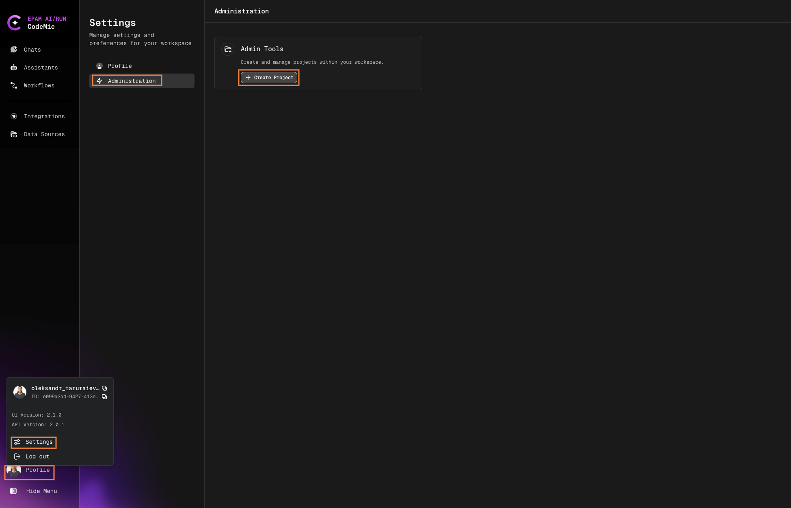

# 3.11 Folders Overview

By default, chat history is sorted by activity order. That is, the most recent chats will be placed at the top of the list. CodeMie also offers the **Group Chats by "Folders"** feature. With this feature, the chat history will be split by folders. Each folder represents a CodeMie assistant that is used in the chat.

## Enable Folder View

To enable this feature, switch the **by "Folders"** toggler:

## Using Folders

When the option is enabled, you will see folders instead of chats. Each folder will be named as an assistant:

:::note
If the chat assistant is deleted, all the chats related to it will be placed in the Default folder.
:::

## Browse Chats in Folders

By selecting a folder, a drop-down chat list will appear:

## Delete Multiple Chats

Chat folders also allow you to delete the entire list of chats by deleting the folder. It is way quicker than deleting each chat one by one:

