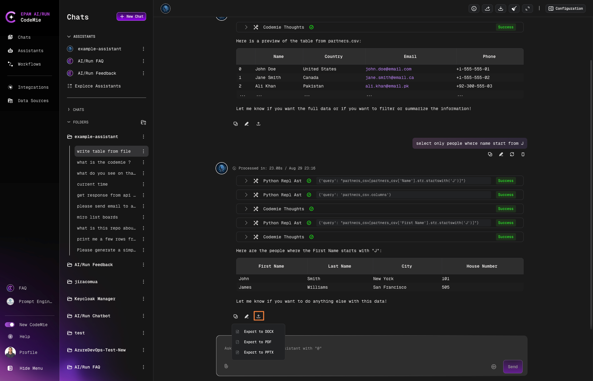

# 3.14 Export Assistant Chat Messages to Word(docx) and PDF Formats

CodeMie allows you to export individual Assistant chat messages to PPTX, Word (DOCX) and PDF formats, preserving the visual rendering of markdown content including tables, code blocks, lists, and images.

## Prerequisites

- You must be authenticated and engaged in an Assistant chat

- At least one Assistant response must be present in the conversation

- The Assistant message should contain the content you want to export

## How to Export Assistant Messages

1. **Locate the Assistant Message**: Find the Assistant response you want to export in your chat conversation

2. **Click Export Button**: Look for the export button in the left button corner of the chat that appears alongside the Assistant's response

3. **Select Format**: Choose your preferred export format:
   - **Powerpoint (PPTX)**: Powerpoint presentation format

   - **Word (DOCX)**: Best for further editing and document collaboration

   - **PDF**: Ideal for sharing and archiving with preserved formatting

4. **Download**: The file will be automatically downloaded to your device

## What Gets Exported

### Included Content:

- Final rendered response from the Assistant

- Properly formatted markdown elements:
  - Tables (rendered as actual tables)

  - Code blocks (with syntax highlighting)

  - Lists and bullet points

  - Images and diagrams

  - Text formatting (bold, italic, headers)

### Excluded Content:

- Tools section information

- Auxiliary system information

- Chat metadata

- User messages (only the specific Assistant response is exported)

## 3.16 Export All Chat Conversation to JSON, Word(docx) and PDF Formats

CodeMie allows you to export the entire chat conversation to JSON, Word (DOCX) and PDF formats.

### How to Export Whole Chat Assistant Messages:

1. **Click Export Button**: Look for the export button in the top right corner of the chat.

2. **Select Format**: Choose your preferred export format:
   - **Powerpoint (PPTX)**: Powerpoint presentation format

   - **Word (DOCX)**: Best for further editing and document collaboration

   - **PDF**: Ideal for sharing and archiving with preserved formatting

3. **Download**: The file will be automatically downloaded to your device

