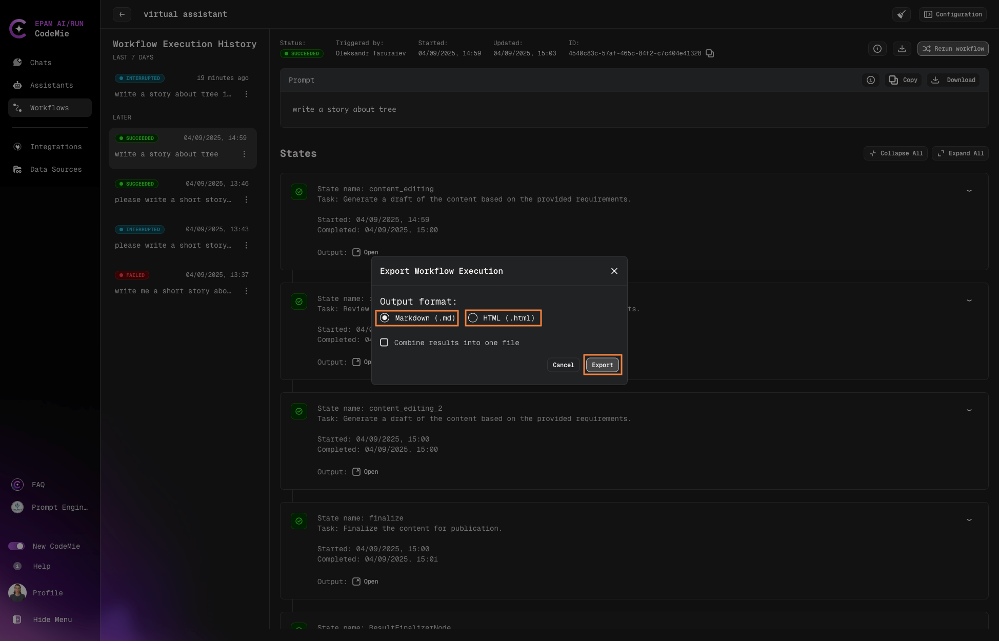

# 3.18 Clone Assistant from Marketplace

All users can clone assistants from the Marketplace to their personal workspace, enabling them to customize and build upon existing community-contributed assistants.

## How to Clone an Assistant

### 1. Navigate to the Assistants

- Go to the **Assistants** section in CodeMie
- Click the **Marketplace** tab to browse available assistants

### 2. Select an Assistant to Clone

- Browse the available assistants in the marketplace
- Click on the assistant you want to clone
- Look for the **Clone** button (available to all authenticated users)

### 3. Choose Your Project and Assistant Name

- When cloning, you'll see a project selection dropdown
- Only projects you're assigned to will be displayed
- Select the appropriate project where you want the cloned assistant to reside
- Type the name of project

:::note
Remember that the Slug name must be unique.
:::

### 4. Complete the Cloning Process

- Click **Clone Assistant** to initiate the process
- The system will create a copy of the selected assistant
- You'll receive a confirmation once cloning is complete
