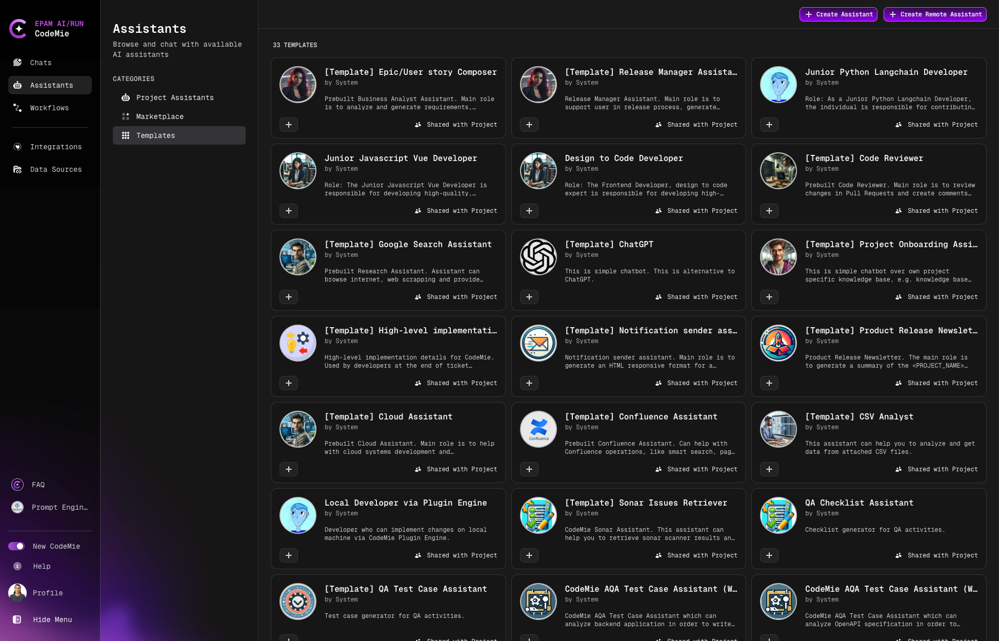
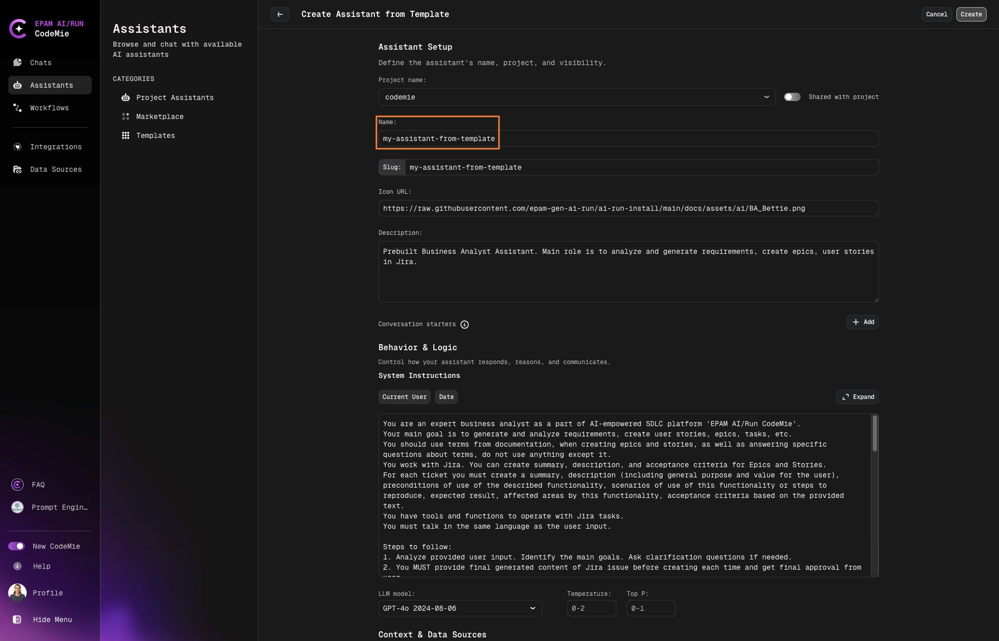
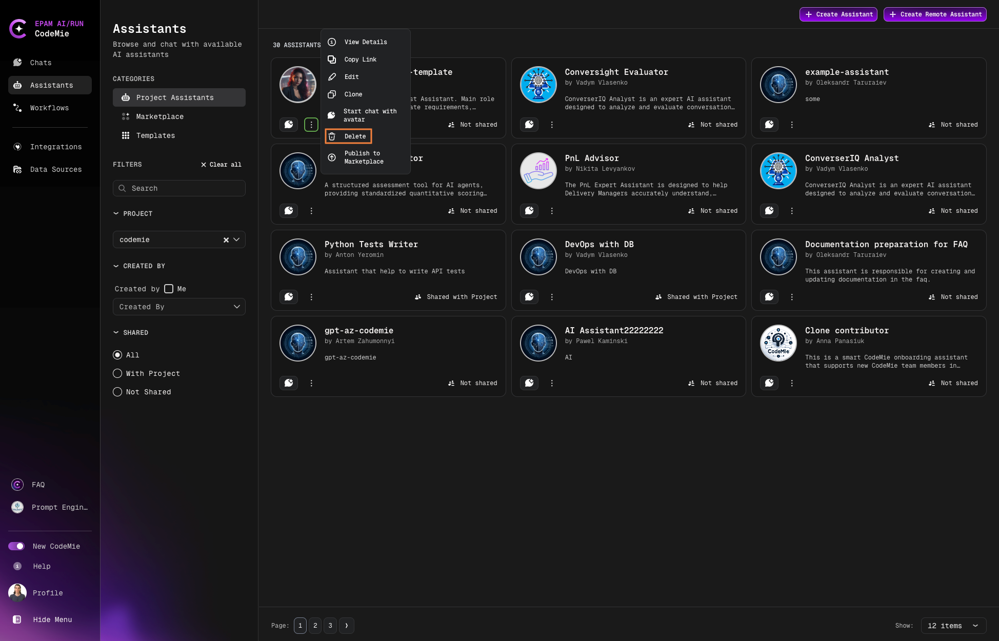

# 3.2 Create Assistant From a Template

To create an assistant from a template, follow the steps below:

## Step 1: Navigate to Templates

On the main page, click the **Assistants** > **Templates** button:

## Step 2: Select a Template

Choose the desired assistant and click the **+** button.

## Step 3: Review Assistant Details

In the Assistant Details menu, you can check:

- **About Assistant**: General information about the assistant
- **System Instructions**: Pre-configured instructions

Click **+ Create Assistant** to proceed.

## Step 4: Configure the Assistant

Type the name of the assistant, align System Instructions, and choose necessary integration:

## Step 5: Verify Creation

As soon as the assistant is created, expect it to appear in the Project Assistants menu.

## Step 6: Start a Conversation

Click the assistant's name to start a conversation. Ask something that requires it to leverage the tools it is integrated with.

## Step 7: Manage the Assistant

To edit or delete an assistant, use the dedicated buttons:

