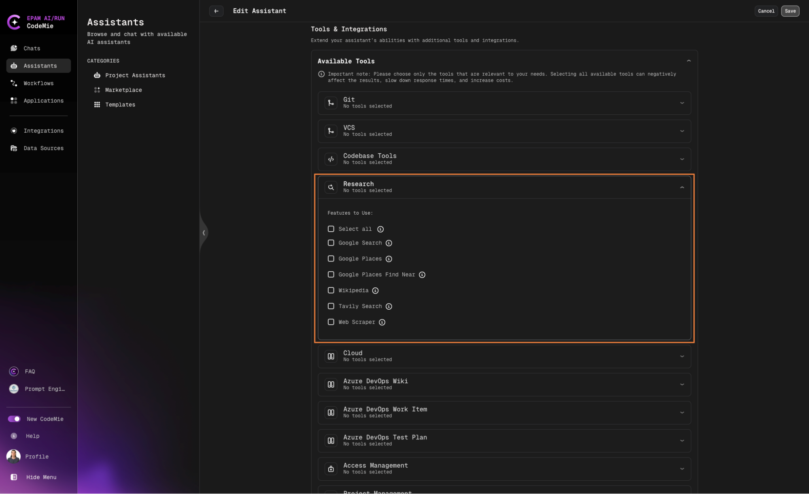

# 3.20 Research Tools

The Research toolkit enables your CodeMie assistants to access real-time information from the internet and perform location-based searches. This comprehensive toolkit includes **six powerful tools** designed to gather fresh, accurate data and location information for your AI assistant.

## Available Research Tools

### Web Search Tools

#### Google Search Tool

**Purpose:** Perform real-time Google searches to access current web information
**Input:** Search query
**Best for:** General web searches, current events, factual information
**Configuration:** No additional setup required

**Example usage:**

```
"Search for the latest Python 3.12 features and updates"
"Find current stock price for NVIDIA"
"What are the recent developments in AI technology?"
```

#### Tavily Search Results

**Purpose:** Comprehensive, accurate search results optimized for current events and AI applications
**Input:** Search query
**Best for:** Research-focused queries, current events, comprehensive analysis
**Configuration:** No additional setup required

**Example usage:**

```
"Research the environmental impact of electric vehicles in 2024"
"Find comprehensive information about quantum computing developments"
"Get up-to-date information about recent policy changes"
```

#### Wikipedia Tool

**Purpose:** Access Wikipedia's vast knowledge base for encyclopedic information
**Input:** Search query
**Best for:** Background information, historical data, general knowledge, biographical information
**Configuration:** No additional setup required

**Example usage:**

```
"Get information about the history of artificial intelligence"
"Explain the concept of blockchain technology"
"Tell me about Marie Curie's scientific contributions"
```

#### Web Scraper Tool

**Purpose:** Extract specific content from websites and convert HTML to markdown format
**Input:** URL (required), plus optional settings for images and links
**Best for:** Extracting content from specific URLs, parsing structured data, reading documentation
**Configuration:** No additional setup required

**Example usage:**

```
"Scrape content from https://example.com/documentation"
"Extract text content from this specific webpage URL"
"Get the main content from this blog post URL"
```

### Location-Based Tools

#### Google Places Tool

**Purpose:** Validate or discover addresses from ambiguous location text
**Input:** Location search query
**Best for:** Address validation, location verification, finding specific places
**Configuration:** No additional setup required

**Example usage:**

```
"Validate this address: 123 Main St, New York"
"Find the correct address for Central Park, NYC"
"Verify if this location exists: Golden Gate Bridge, San Francisco"
```

#### Google Places Find Near Tool

**Purpose:** Find places near a specific location using Google Places API
**Input:** Current location query (required), Target location/query (required), Search radius (optional)
**Best for:** Finding businesses, landmarks, or services near a particular location
**Configuration:** No additional setup required

**Example usage:**

```
"Find coffee shops near Times Square, New York"
"Locate gas stations within 5 miles of downtown Chicago"
"Find restaurants near my current location"
```

## How to Enable Research Tools

1. Navigate to **Create Assistant** or **Edit Assistant**

2. In the **Available tools** section, find **Research**



3. Select the specific research tools you want to enable for your assistant and click **Save** button

4. All tools are immediately available - no additional configuration needed
