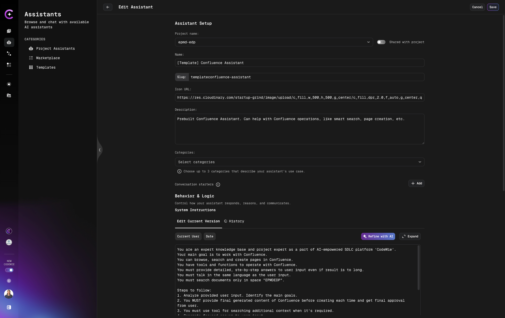
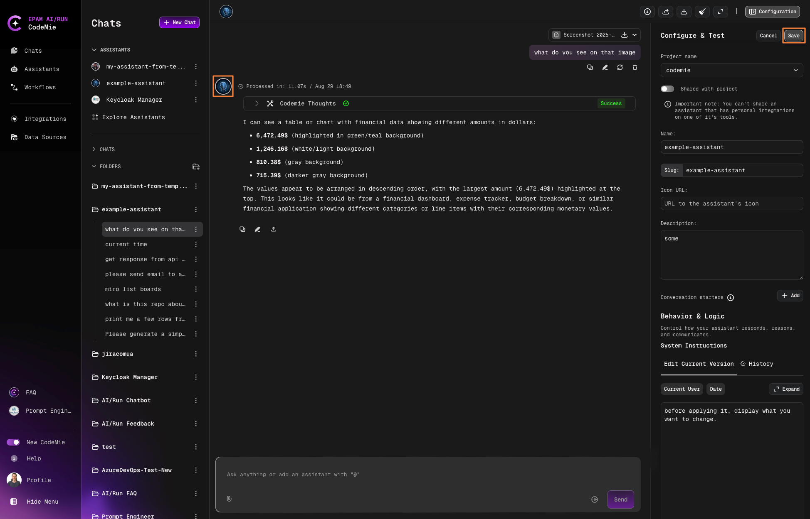

# 3.4 Edit Assistants

Sometimes, assistants need improvements or changes to process prompts more efficiently. To address this issue, assistants support editing on the fly, with no need to create another assistant or chat.

## Edit Assistant from Assistants Page

To edit an assistant, follow the steps below:

1. Navigate to **AI/Run CodeMie** -> **Assistants**:

   

2. Click the **Actions** button and select **Edit**.

3. Make changes and click **Save**:

   

## Edit Assistant from Chat

Second approach - edit assistant directly from chat:

1. Click on the assistant icon or configuration button, change necessary settings and click **Save** button:

   
