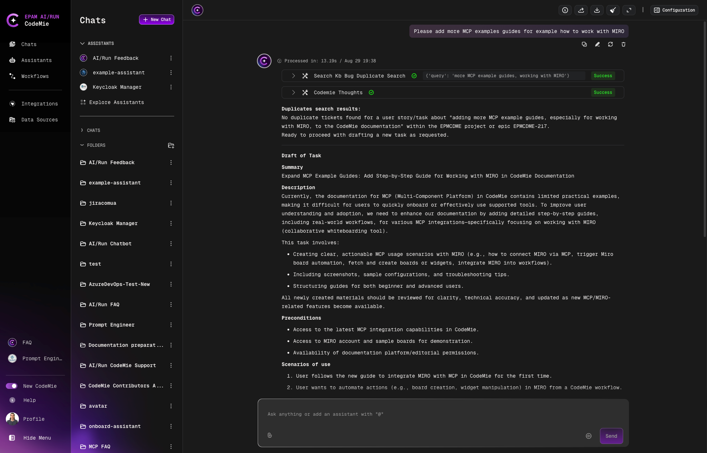
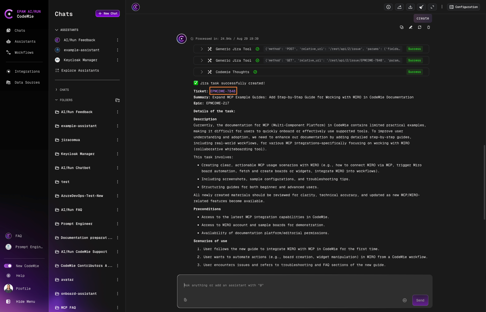

# 3.6 How to Report Bug/Feature to the AI/Run CodeMie Team

We value your support and look forward to receiving feedback from you about any issues or enhancements. To contact our team, the "AI/Run Feedback" assistant was created. Use of this assistant requires Jira tool integration.

## Prerequisites: Integrate AI/Run CodeMie with Jira

1. Log into Jira and click your profile image, then select **Profile** from the menu

2. Select **Personal Access Tokens** and click the **Create token** button

3. Fill in the required fields

4. Click **Create API token**

5. Enter a Label and click **Create**:

   

:::note
The token permissions are supposed to be set to the level of access you currently have.
:::

## Create a Jira Issue Using AI/Run Feedback

1. Navigate to **Help** → **AI/Run Feedback**:

   

2. Report the feature or bug you would like the AI/Run CodeMie team to fix or improve:

   

3. Explore the created issue by clicking the link provided by the assistant:

   
