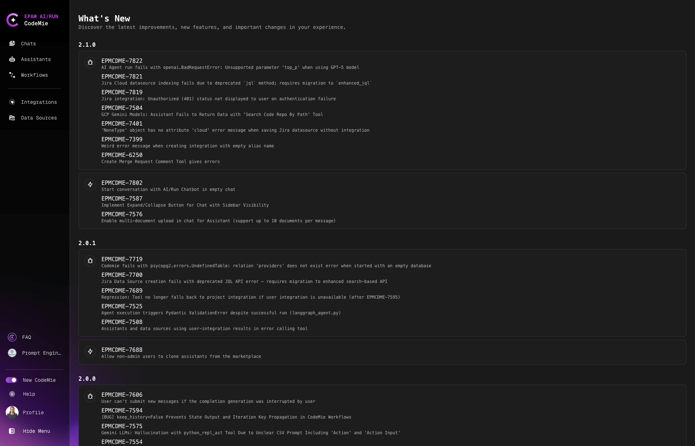

# 3.7 View AI/Run CodeMie Updates

Our team is continuously working on refining AI/Run CodeMie. Based on your feedback, we release new updates to deliver the best experience for you.

## Update Notifications

Once a new release is published, we notify users at the very first login to AI/Run CodeMie after the release update:

## Check Updates Manually

Alternatively, you can check updates at any time:

1. Click **Help** → **Release Notes**

2. Click the **See What's New** button:

   

   
