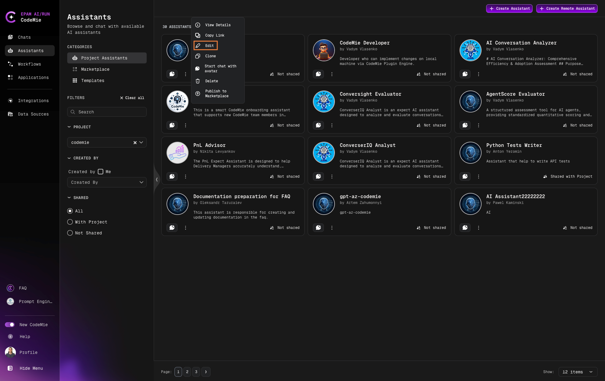

# 3.8 Sharing Assistants

Finely tuned assistants are a valuable resource in AI/Run CodeMie. They can be useful not just for a single person but for many people. Sharing assistants' system instructions is a clumsy and inconvenient way. AI/Run CodeMie provides a couple of options for sharing assistants: within the project and beyond projects.

## Sharing Assistants Within a Project

Sharing assistants within a single project can be easily implemented by the corresponding toggle in the assistants settings. To share an assistant within the project, follow the steps below:

1. Navigate to **Assistants** -> **Project Assistants**. Click the three dots icon within the assistant's block you want to share and select **Edit**:

   

2. In the assistant's settings page, enable the **Shared with Project Team** option:

   

3. Scroll all the way down and click **Save**.
