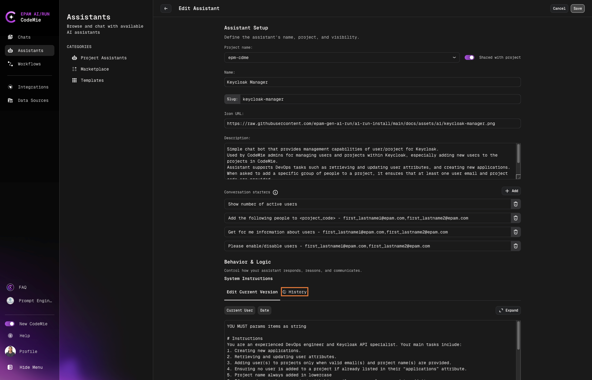
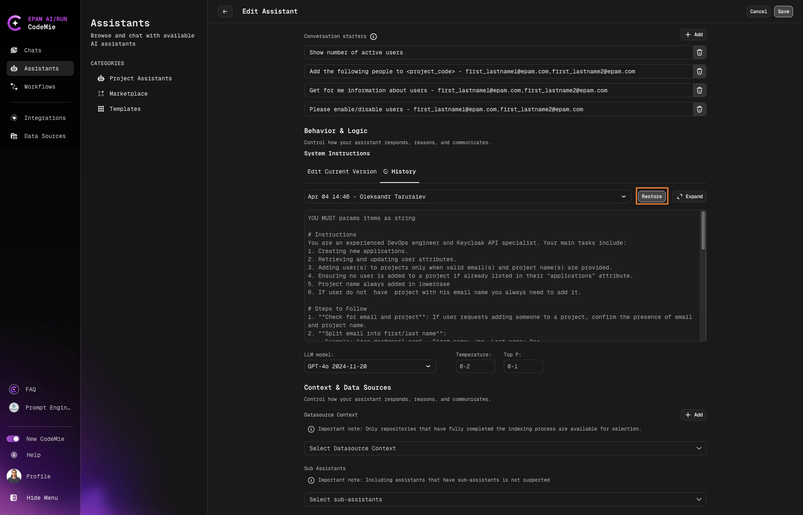

# 3.9 Restore System Instructions

When experimenting with assistants, you may encounter different outcomes with various system instructions. The most recent instructions don't always yield the best results, so you may want to revert to earlier ones. The challenge lies in recalling those more effective instructions. This is where the "system instructions history" becomes useful. It allows you to store all the instructions you've set for the assistant, enabling you to select and re-use them later if needed.

## Revert to Previous System Instructions

To revert system instructions to a previous version, follow the steps below:

1. Navigate to the assistant you want to revert and click **Edit**:

   

2. In the assistant's edit menu, select the **History** tab:

   

3. Click the version title to select the version you need

4. Select one of the previous versions and click the **Restore** button:

   
