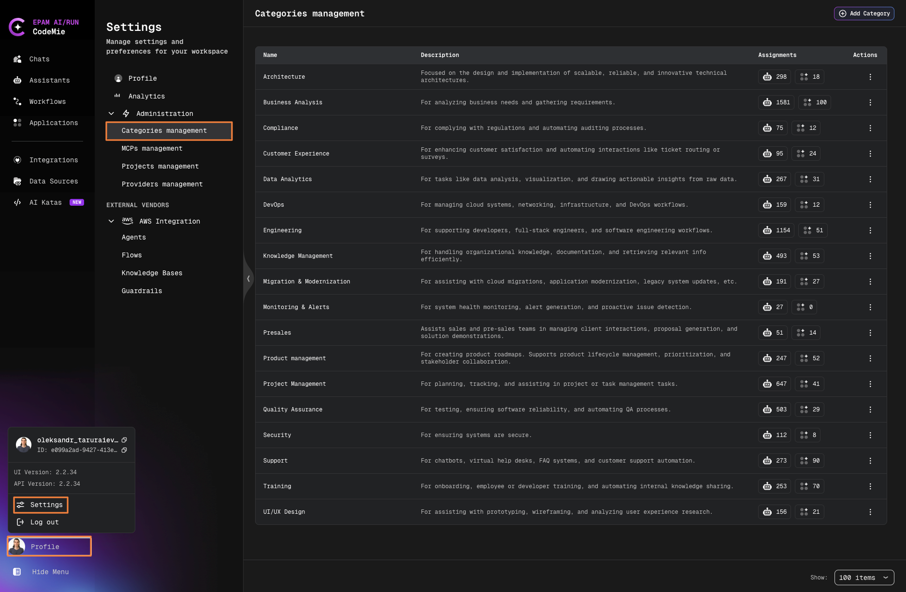
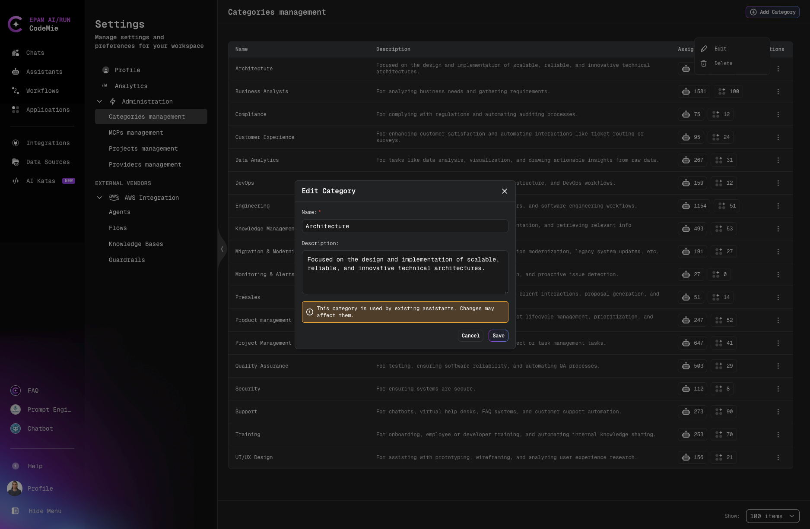

# Assistant Categories Management

Organize marketplace and project assistants using categories for better structure and filtering.

:::warning Access Required
This functionality is only available to users with the [isAdmin](/user-guide/getting-started/glossary#jwt-attributes) permissions.
:::

## Category Interface

Each category displays:

- **Category Name**
- **Assistant Count** (separated by type):
  - **Marketplace**: Clickable count - opens filtered list of marketplace assistants
  - **Personal**: Display-only count of personal/project assistants
- **Actions**: Edit and Delete buttons

## Create/Edit Category

1. Click **Add Category**

2. Enter:
   - **Category Name** (required)
   - **Description** (optional)
3. Click **Create**/**Save**

:::warning
When editing a category with assigned assistants, a warning displays showing:

- Number of assistants that will be affected
- Reminder that changes may impact assigned assistants
  :::

## Delete Category

**Delete is disabled** for categories with any assigned assistants.

To delete:

1. Reassign all assistants to other categories
2. Click **Delete** button (trash icon)
3. Confirm deletion
