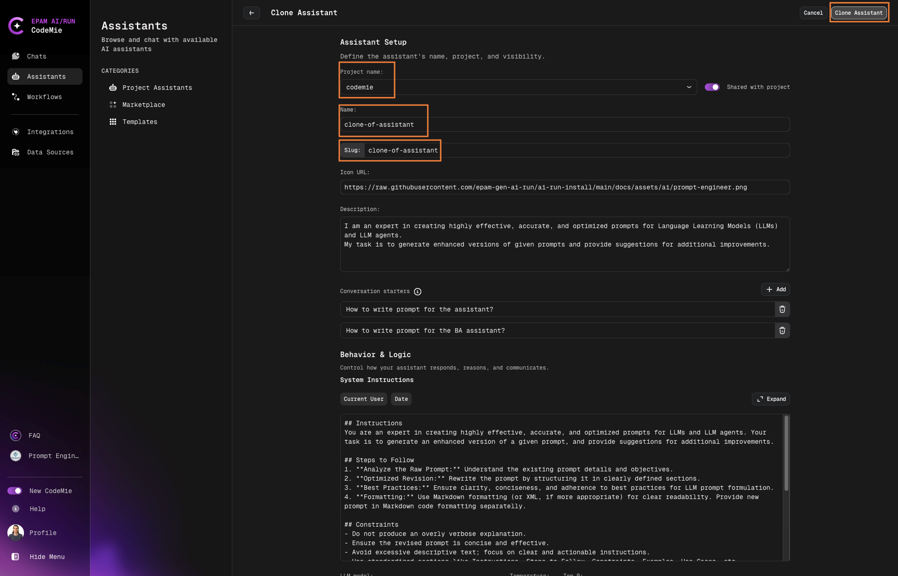

# Clone Assistant from Marketplace

Clone assistants from the Marketplace to your workspace to customize and build upon community-contributed solutions. All authenticated users can clone any marketplace assistant.

## Clone an Assistant

### 1. Navigate to Marketplace

1. Go to **Assistants** → **Marketplace**.

2. Browse available assistants in the catalog.

### 2. Select an Assistant

1. Click on the assistant card you want to clone.

2. Review the assistant details, categories, and adoption metrics.

3. Click the **Clone** button:

   

### 3. Configure Clone Settings

1. Select your target project from the dropdown:

   
   - Only projects you're assigned to will be displayed
   - Choose the appropriate project for your cloned assistant

2. Enter a name for the cloned assistant.

3. Ensure the slug name is unique within your project.

:::info Slug Requirements
The slug name must be unique across your project. If the name conflicts with an existing assistant, you'll be prompted to choose a different name.
:::

### 4. Complete Cloning

1. Click **Clone Assistant** to initiate the process.

2. The system will create a copy with all configurations.

3. You'll receive a confirmation once cloning is complete.

## After Cloning

The cloned assistant appears in your **Project Assistants** section where you can:

- Modify system instructions
- Change configurations
- Add or remove tools
- Adjust model settings
- Customize for your specific use case

:::tip Customization
Cloned assistants are fully independent copies. Modify them freely without affecting the original marketplace assistant.
:::
