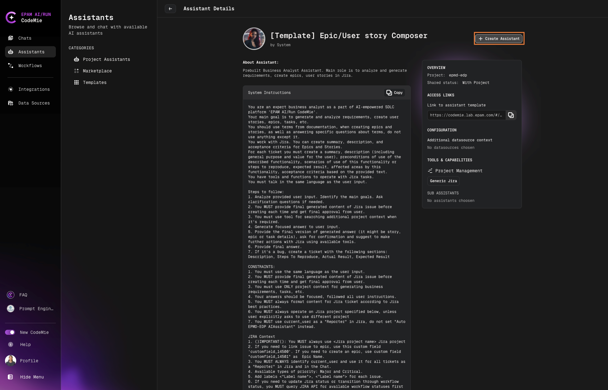

# Create Assistant From a Template

Creating an assistant from a template is the quickest way to get started with AI/Run CodeMie's specialized assistants.

## Steps to Create from Template

1. Navigate to **Assistants** → **Templates**:

   

2. Browse available templates and click the **+** button on your desired assistant.

3. Review the assistant details:
   - **About Assistant**: Description and purpose
   - **System Instructions**: Pre-configured prompts

   Click **+ Create Assistant** to proceed:

   

4. Configure your assistant:
   - **Name**: Enter a descriptive name
   - **System Instructions**: Review and adjust if needed
   - **Integrations**: Select necessary tools and data sources

   

5. Once created, the assistant will appear in your **Project Assistants** menu.

6. Start using your assistant:
   - Click the assistant's name to begin a conversation
   - Test it with tasks that utilize its integrated tools

7. Manage your assistant using the action buttons:

   

:::tip
Template assistants come pre-configured with appropriate tools and system instructions for their specific roles. You can customize these settings after creation to better fit your needs.
:::
