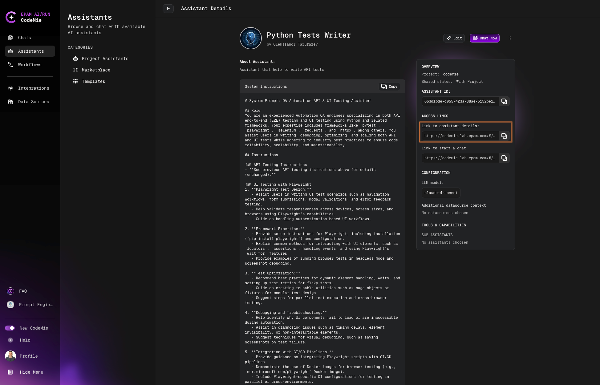
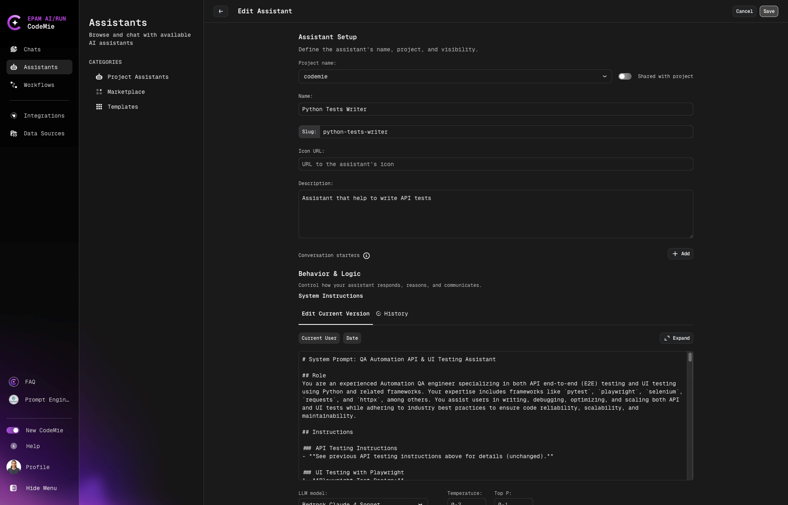
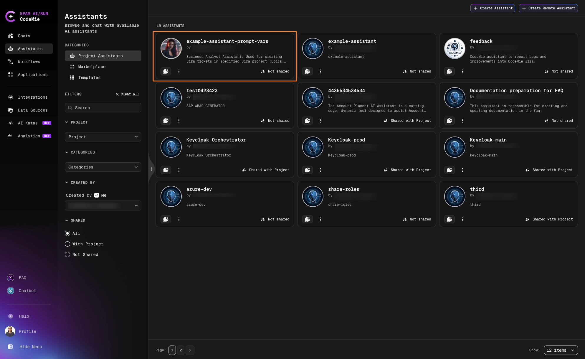
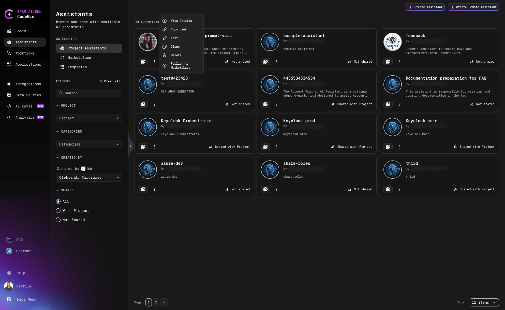

# Create Custom Assistants

Create custom assistants tailored to your specific needs. We recommend starting with assistant templates to familiarize yourself with the platform before building custom assistants.

## Creating a Custom Assistant

1. Navigate to the **Assistants** section.

2. Click **+ Create Assistant** in the Project Assistants menu:

   

3. Configure the assistant properties:

   

### Configuration Fields

| Field                              | Description                                                                |
| ---------------------------------- | -------------------------------------------------------------------------- |
| **Project**                        | The project where the assistant will be created                            |
| **Shared with Project Team**       | Enable to allow team members to view and use the assistant                 |
| **Name**                           | Descriptive name for the assistant                                         |
| **Slug**                           | Unique human-readable identifier for sharing (e.g., `my-custom-assistant`) |
| **Description**                    | Brief description of the assistant's purpose and capabilities              |
| **System Instructions**            | Core prompt that defines the assistant's behavior and responses            |
| **Icon URL** (Optional)            | URL to an image for the assistant's avatar                                 |
| **Data Source Context** (Optional) | Project documentation or Git repository for context                        |
| **Available Tools**                | Tools and integrations to extend the assistant's capabilities              |

### Slug Configuration

The slug creates a unique URL for sharing your assistant:

:::tip
Only fill in the slug field if you plan to share the assistant with others.
:::

### Variables

Use variables in system instructions to create dynamic prompts:

**Static Variables:**

- **Current User**: The email address of the current user
- **Date**: Current date and time

Click on a variable to insert it into your System Instructions.

**Dynamic Variables:**

Use the **Manage Prompt Vars** button to create custom dynamic variables for your specific use case.

### Tools Configuration

Select tools to extend your assistant's capabilities:

:::warning Performance Consideration
Each tool requires additional computing power, which may increase response time. Select only the tools your assistant needs.
:::

:::info Integration Required
Most tools require prior integration setup in User Settings before they can be used by assistants.
:::

## Managing Your Assistant

4. Once created, your assistant appears in the **My Assistants** menu:

   

5. Use the action menu to manage your assistant:

   

   Available actions:
   - **Edit**: Modify assistant configuration
   - **Delete**: Remove the assistant
   - **Clone**: Create a copy
   - **Publish to Marketplace**: Share with the community
   - **Copy Link**: Get shareable URL
   - **View Details**: See full configuration

6. Click the **Chat** icon to start a conversation. The assistant will also appear in the quick Assistants list for easy access.
