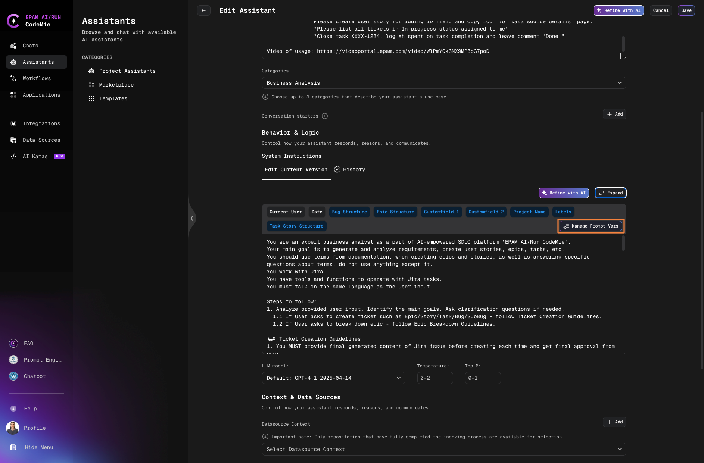
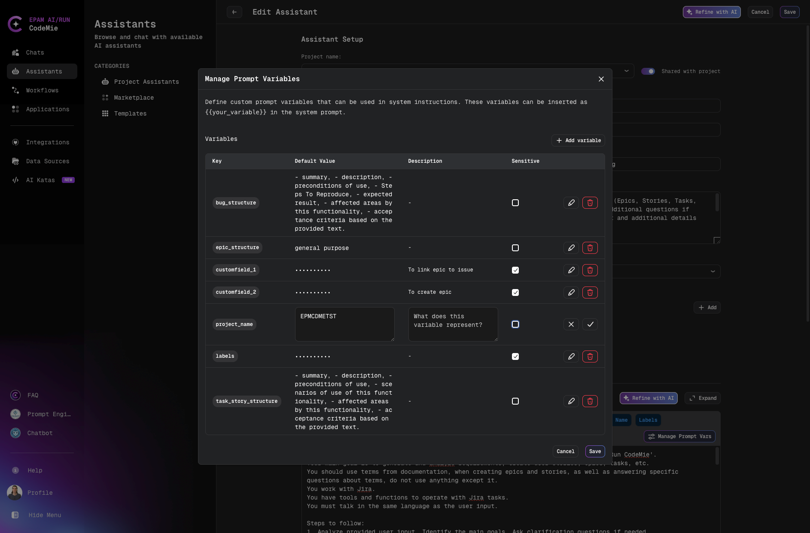
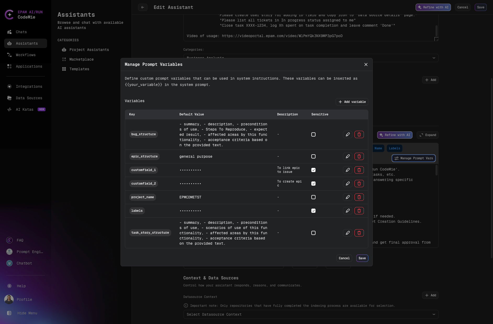

# Create Custom Assistants

Create custom assistants tailored to your specific needs. We recommend starting with assistant templates to familiarize yourself with the platform before building custom assistants.

## Creating a Custom Assistant

1. Navigate to the **Assistants** section.

2. Click **+ Create Assistant** in the Project Assistants menu:

   

3. Configure the assistant properties:

   

### Configuration Fields

| Field                              | Description                                                                |
| ---------------------------------- | -------------------------------------------------------------------------- |
| **Project**                        | The project where the assistant will be created                            |
| **Shared with Project Team**       | Enable to allow team members to view and use the assistant                 |
| **Name**                           | Descriptive name for the assistant                                         |
| **Slug**                           | Unique human-readable identifier for sharing (e.g., `my-custom-assistant`) |
| **Description**                    | Brief description of the assistant's purpose and capabilities              |
| **System Instructions**            | Core prompt that defines the assistant's behavior and responses            |
| **Icon URL** (Optional)            | URL to an image for the assistant's avatar                                 |
| **Data Source Context** (Optional) | Project documentation or Git repository for context                        |
| **Available Tools**                | Tools and integrations to extend the assistant's capabilities              |

### Slug Configuration

The slug creates a unique URL for sharing your assistant:


:::tip
Only fill in the slug field if you plan to share the assistant with others.
:::

### Variables

Use variables in system instructions to create dynamic prompts:

**Static Variables:**

- **Current User**: The email address of the current user
- **Date**: Current date and time

Click on a variable to insert it into your System Instructions.

**Dynamic Variables:**

Use the **Manage Prompt Vars** button to create custom dynamic variables for your specific use case.

#### Managing Sensitive Prompt Variables

Sensitive prompt variables allow you to securely store credentials, API keys, passwords, and other confidential information that your assistant needs. These variables are encrypted and masked in the UI to protect sensitive data.

**Key Features:**

- **Encryption**: Sensitive variable values are encrypted for security
- **Masking**: Values are displayed as `**********` in the UI
- **Shield Icon**: Visual indicator for sensitive fields with "Encrypted credential" tooltip
- **User-specific Values**: Each user can have their own values for sensitive variables
- **Thread Safety**: Values are isolated between concurrent requests

**Configuration:**

1. Click **Manage Prompt Vars** button in the System Instructions section:

   

2. In the Variables table, configure your prompt variables:
   - **Key**: Variable name (used as `{{your_variable}}` in system instructions)
   - **Default Value**: The value to use (will be masked if marked as sensitive)
   - **Description**: Optional explanation of the variable's purpose
   - **Sensitive**: Check this box to mark the variable as sensitive

   To edit the sensitive status of an existing variable:
   - Click the **pencil icon** (edit) next to the variable
   - Check or uncheck the **Sensitive** checkbox
   - Click the **checkmark icon** to apply changes
   - Click **Save** button in the dialog to save all changes
   - Click **Save** button in the assistant window to finalize

   

3. When editing a variable, you'll see the shield icon next to sensitive fields:

   

**Use Cases:**

- **API Credentials**: Store API keys for external services (e.g., `{{API_KEY}}`)
- **Authentication Tokens**: Manage access tokens securely (e.g., `{{ACCESS_TOKEN}}`)
- **Database Passwords**: Store database credentials (e.g., `{{DB_PASSWORD}}`)
- **Service Accounts**: Manage service account credentials
- **Custom Fields**: Any sensitive data specific to your workflow (e.g., `{{JIRA_TOKEN}}`)

**Example Usage in System Instructions:**

```
You are a DevOps assistant with access to infrastructure tools.

Use the following credentials when needed:
- API Key: {{API_KEY}}
- Database Password: {{DB_PASSWORD}}
- Service Token: {{SERVICE_TOKEN}}

Always use these credentials securely and never expose them in responses.
```

:::warning Important

- Sensitive variables are marked with a shield icon in the UI
- Values are encrypted and only decrypted when needed by the assistant
- Each user can override sensitive variable values with their own credentials
- Backward compatibility is maintained - variables without the sensitive flag default to non-sensitive
- **Once a variable is marked as sensitive and saved, the value cannot be recovered if you uncheck the sensitive flag** - it will remain masked as `**********`. You will need to re-enter the value if you want to convert it back to a regular variable.
  :::

### Tools Configuration

Select tools to extend your assistant's capabilities:


:::warning Performance Consideration
Each tool requires additional computing power, which may increase response time. Select only the tools your assistant needs.
:::

:::info Integration Required
Most tools require prior integration setup in User Settings before they can be used by assistants.
:::

## Managing Your Assistant

4. Once created, your assistant appears in the **My Assistants** menu:

   

5. Use the action menu to manage your assistant:

   

   Available actions:
   - **Edit**: Modify assistant configuration
   - **Delete**: Remove the assistant
   - **Clone**: Create a copy
   - **Publish to Marketplace**: Share with the community
   - **Copy Link**: Get shareable URL
   - **View Details**: See full configuration

6. Click the **Chat** icon to start a conversation. The assistant will also appear in the quick Assistants list for easy access.
