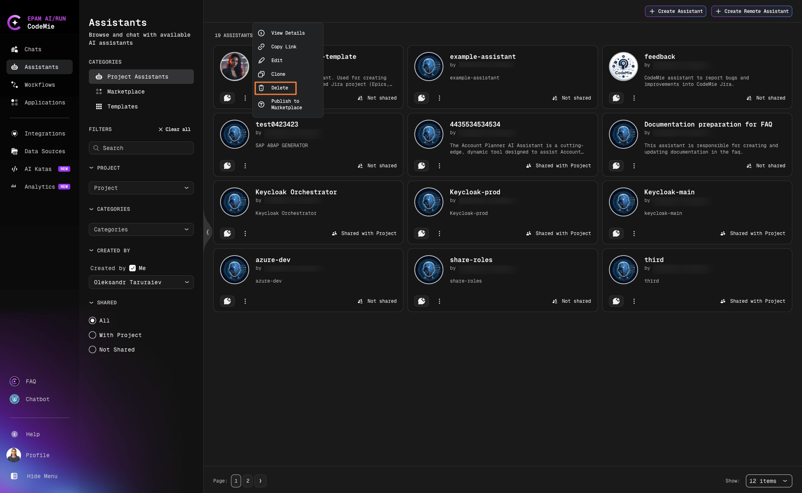
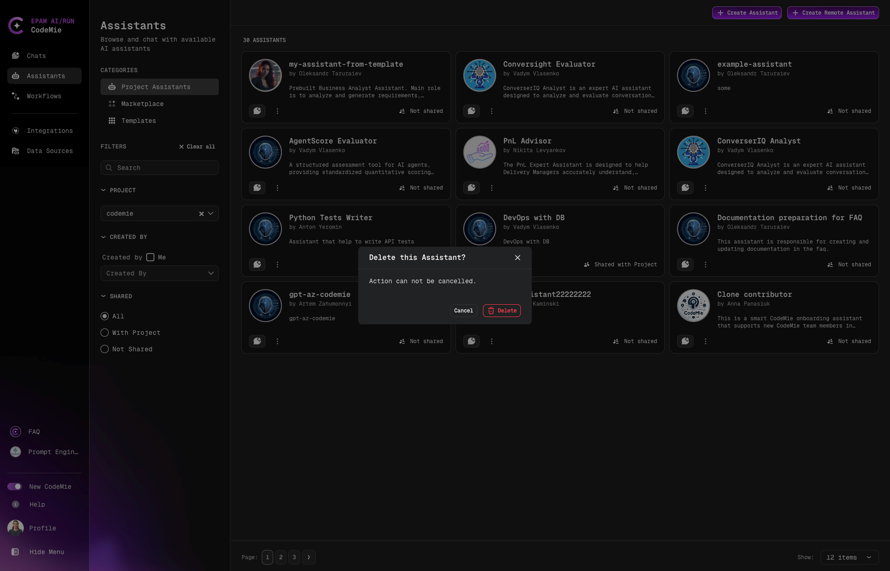
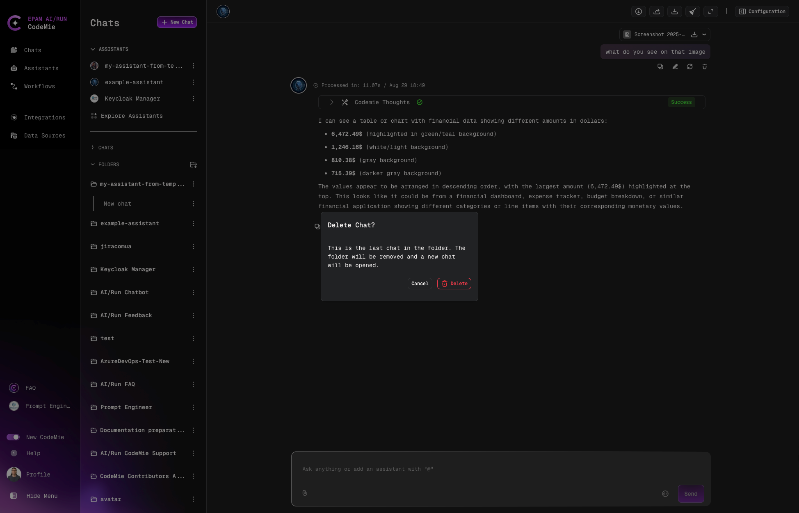

# Delete Assistants and Chats

Keep your workspace organized by removing unused assistants and chat conversations. This improves navigation and reduces clutter.

## Delete an Assistant

1. Navigate to **Assistants** → **Project Assistants**.

2. Click the **Actions** button (⋮) next to the assistant and select **Delete**:

   

3. Confirm the deletion:

   

:::warning Chat Impact
When you delete an assistant, existing chats with that assistant will no longer function. You must delete the chats manually.
:::

## Delete a Chat

1. Click the **Chats** icon in the navigation.

2. Select the conversation you want to delete.

3. Click the **settings button** (⋮) and select **Delete**:

   

4. Confirm the chat deletion:

   

:::tip Bulk Cleanup
Consider regularly reviewing and removing unused assistants and chats to maintain a clean workspace.
:::
