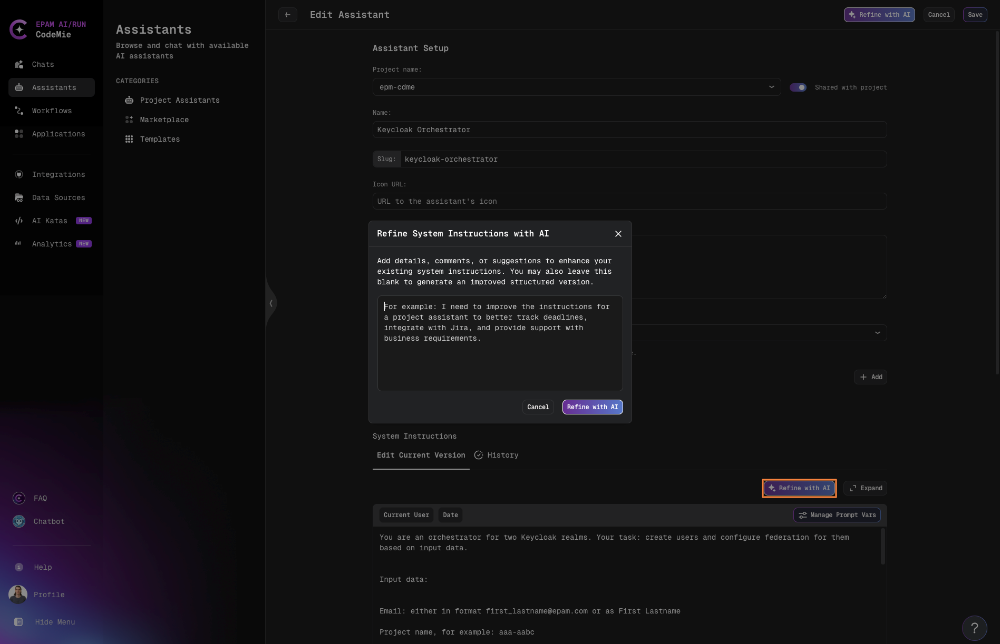

# Edit Assistants

Assistants can be edited at any time to improve performance or adapt to new requirements. Changes take effect immediately without creating a new assistant or chat.

## Manual Editing

### Method 1: Edit from Assistants List

1. Navigate to **Assistants** section:

   

2. Click the **Actions** button (⋮) next to your assistant and select **Edit**.

3. Make your changes and click **Save**:

   

### Method 2: Edit from Chat

1. Click the **assistant icon** or **configuration button** in the active chat:

   

2. Update the necessary settings.

3. Click **Save** to apply changes.

:::tip Quick Edits
Editing from within a chat is the fastest way to make quick adjustments while testing your assistant's responses.
:::

## Refine with AI

Use AI-powered refinement to improve your assistant's configuration automatically.

1. Navigate to **Assistants** section.

2. Click the **Actions** button (⋮) next to your assistant and select **Edit**.

3. To improve your assistant together with its configurations, use the **Refine with AI** functionality in the top right corner of the Edit Assistant page:
   - Describe what you'd like to improve or refine about this assistant
   - The AI will analyze your configuration and suggest improvements

   

4. To enhance only the system instructions, use the **Refine with AI** button located at the top of the System Instructions section.

   

:::info AI-Powered Refinement
Refine with AI analyzes your current assistant configuration and applies improvements based on your requirements, helping you optimize performance and effectiveness without manual trial and error.
:::
