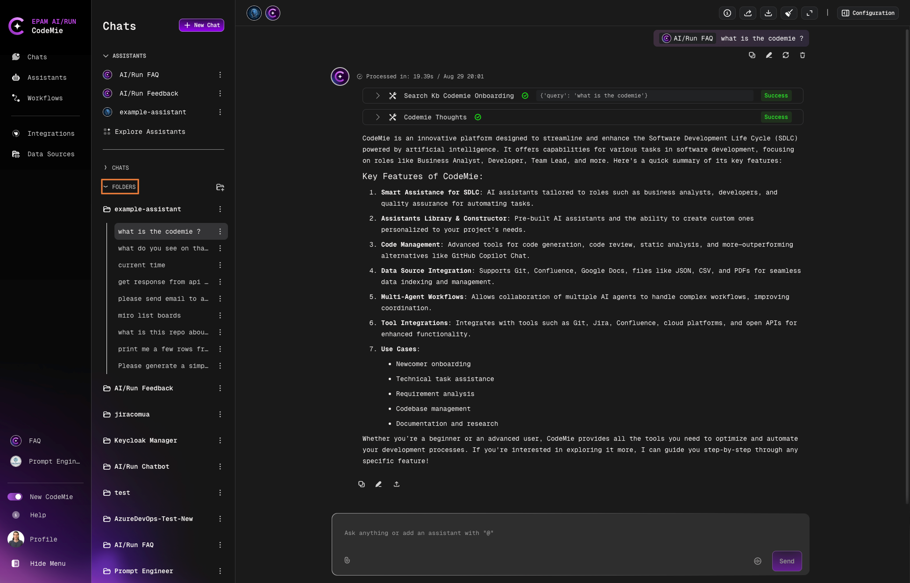
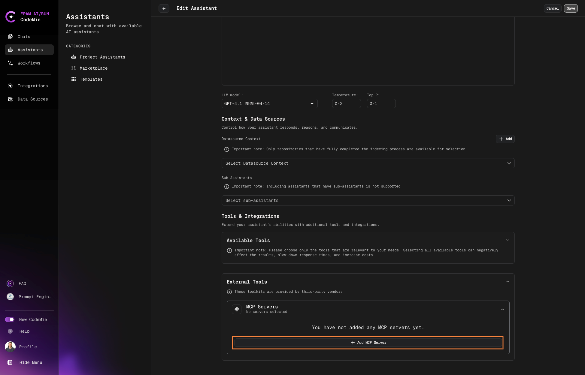
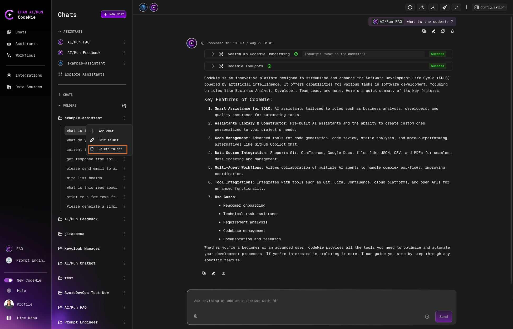
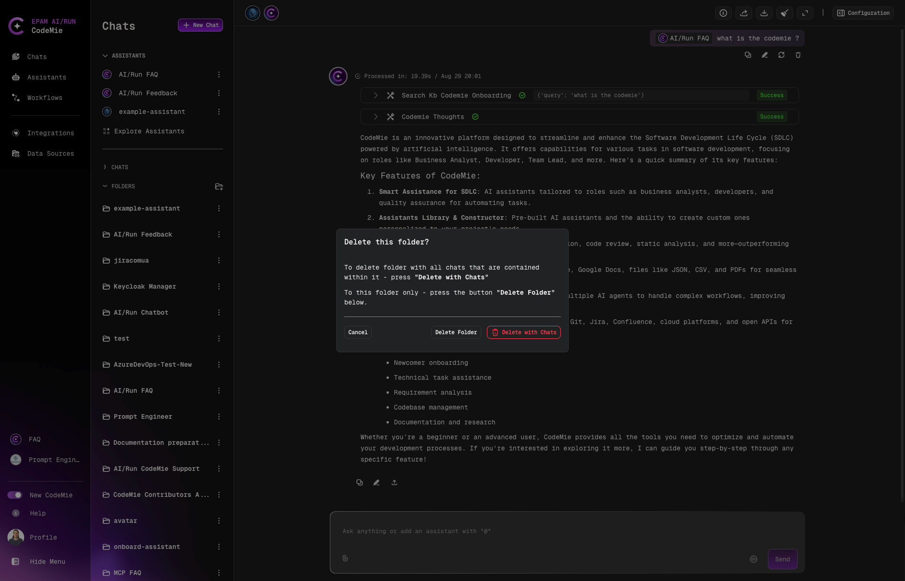

# Folders Overview

Organize your chat history by grouping conversations based on the assistants you use. This provides better structure than the default chronological view.

## Default View vs Folder View

**Default View**: Chats are sorted by most recent activity, with the latest conversations at the top.

**Folder View**: Chats are grouped into folders, with each folder representing a specific assistant.

## Enable Folder View

Toggle the **by "Folders"** option in the chat navigation:

## Working with Folders

### Browse Folders

When folder view is enabled, you'll see folders named after your assistants:

### View Chats in a Folder

Click a folder to expand the drop-down list of conversations:

### Bulk Delete Chats

Delete all chats within a folder by deleting the folder itself:

:::tip Bulk Operations
Deleting a folder removes all associated chats at once, which is much faster than deleting conversations individually.
:::

:::note Deleted Assistants
If an assistant is deleted, all related chats will be moved to the **Default** folder.
:::
