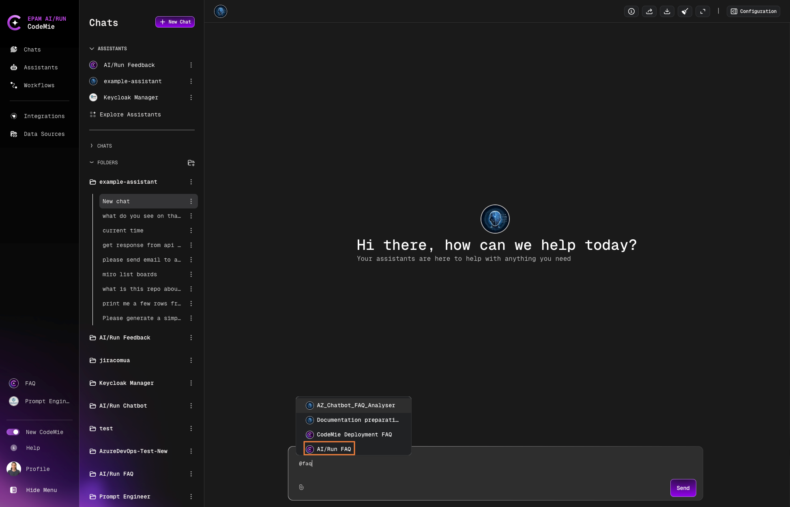

# Group Chats

Group chats provide a unified interface for interacting with multiple assistants without switching between individual conversations. This streamlines workflows and reduces chat clutter.

## What Are Group Chats?

Group chats are not linked to a specific assistant. Instead, you can address any available assistant within the same conversation using the `@` mention system.

**Benefits**:

- Communicate with multiple assistants in one place
- Eliminate context switching between chats
- Avoid creating numerous single-purpose chats
- Maintain conversation flow while delegating to different assistants

## Create a Group Chat

1. Start a new chat without selecting a specific assistant.

2. Type `@` to see the list of available assistants:

   

3. Select an assistant from the list and ask your question:

   

## Switch Between Assistants

All subsequent messages will be directed to the most recently mentioned assistant. To switch assistants:

1. Type `@` and select a different assistant.

2. The assistant's portrait will update to indicate the active assistant.

3. Continue your conversation with the new assistant.

:::tip Model Configuration
Each assistant uses its configured model to process requests. If you don't specify a model explicitly, the assistant will use the default model from its configuration.
:::

:::note First Message
The first message in a group chat must always mention an assistant using the `@` symbol. This establishes the initial context for the conversation.
:::
