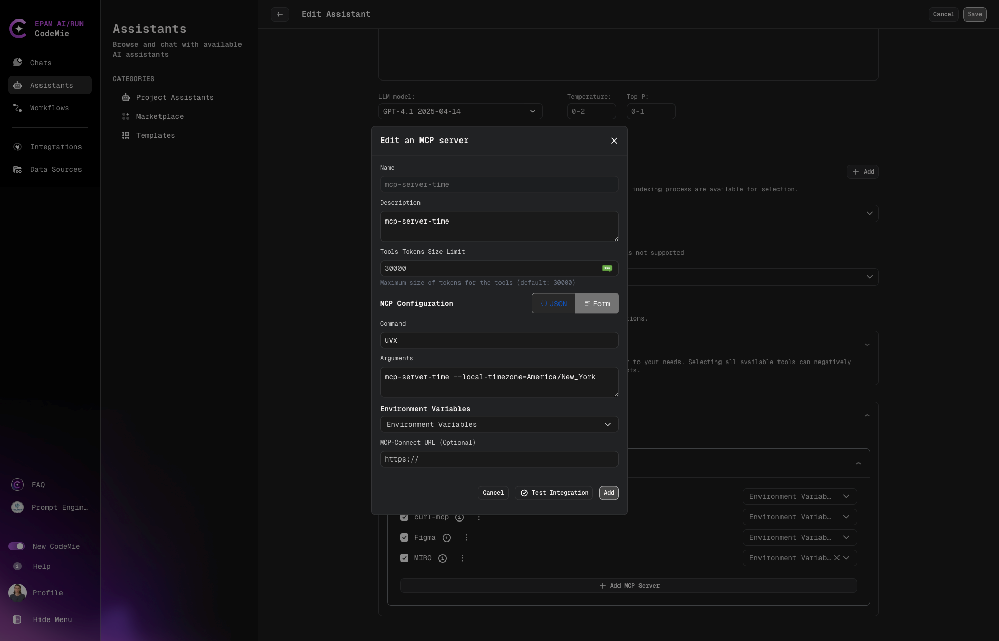

# Marketplace Overview

The Marketplace is a centralized hub where you can discover, explore, and deploy ready-to-use assistants created by the community. Access a curated collection of assistants tailored for various use cases.

## Key Features

### Community Catalog

Browse a curated catalog of community-contributed assistants, each designed for specific tasks and workflows.

### User Engagement

- **Like/Dislike**: Rate assistants to help others discover quality solutions
- **Adoption Metrics**: See how many users have adopted each assistant
- **Popular Ranking**: Most adopted assistants appear at the top

### Enhanced Filtering

- Always-visible filter panel for quick access
- Combine multiple filters to narrow results
- Personal assistant filter to find your published assistants with a single checkbox

## Getting Started

1. Navigate to **Assistants** → **Marketplace**.
2. Browse available assistants or use filters to find specific solutions.
3. Click on an assistant card to view details.
4. Clone assistants to your workspace for customization.

:::tip Publishing Your Assistant
Want to share your assistant with the community? See [Publish to Marketplace](./marketplace-publishing) for publishing guidelines and credential policies.
:::
