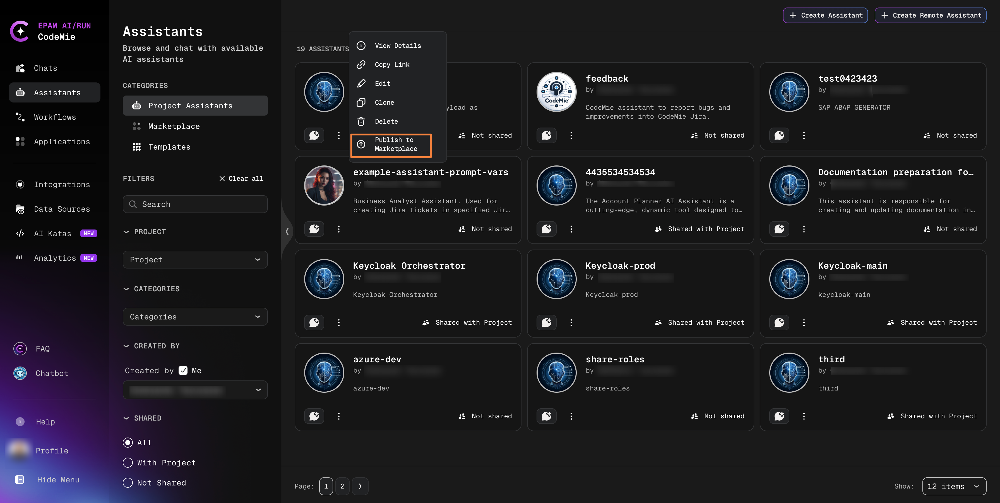
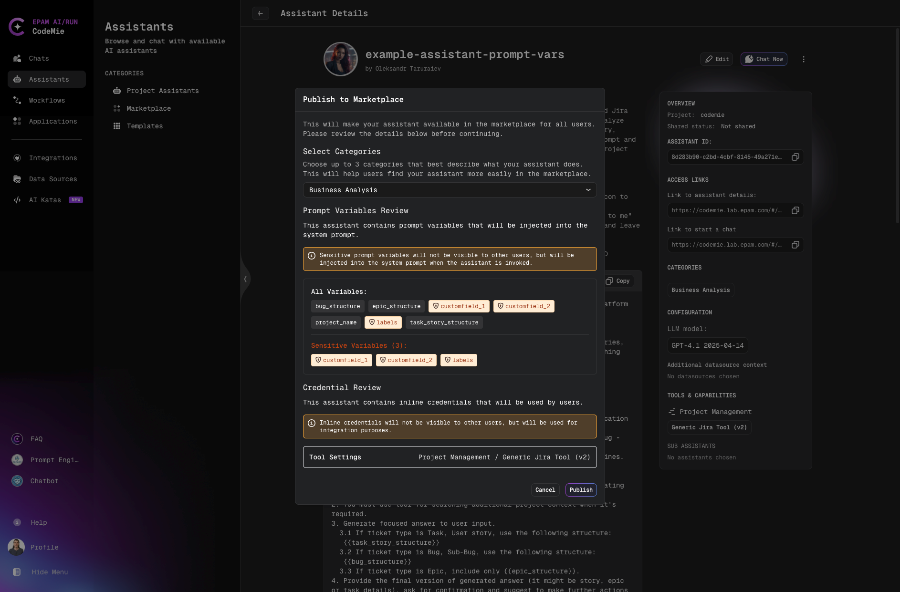
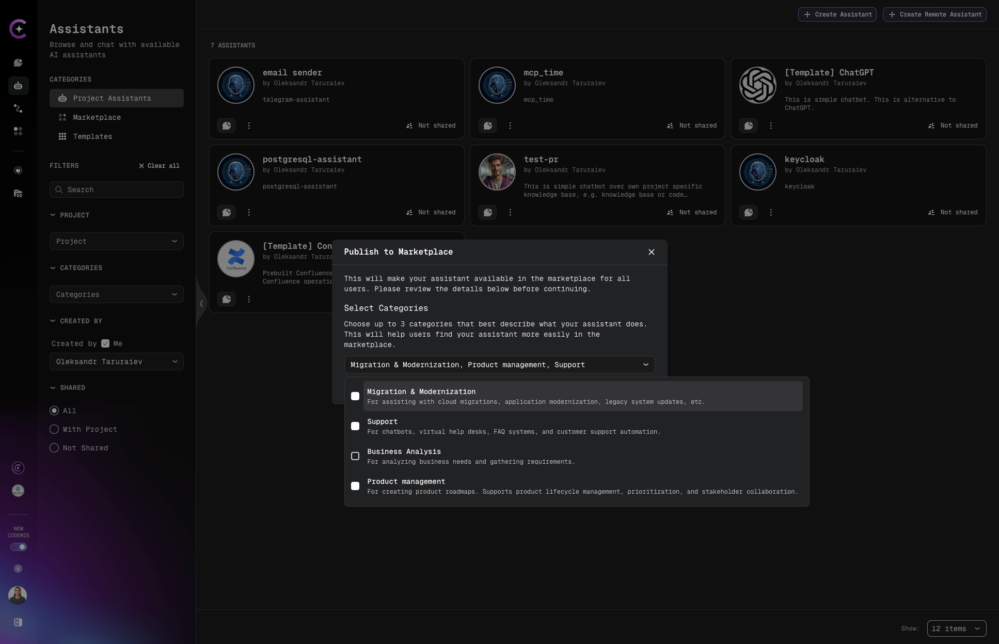
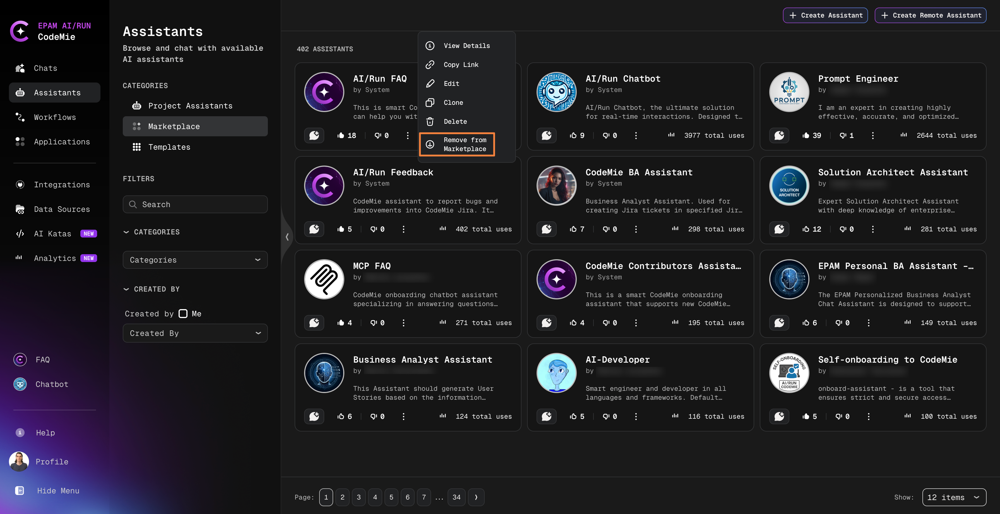

# Publish to Marketplace

Share your custom assistants with the AI/Run CodeMie community by publishing them to the Marketplace. Follow the publishing process to ensure your assistant is properly configured and secure.

## Publishing Process

1. Create and configure your assistant in the **Project Assistants** section.

2. Click the **Publish to Marketplace** button on your assistant card:

   

3. The system will validate your assistant for publishing eligibility.

## Credential Policies

### Personal/Project Credential Detection

Before publishing, the system checks for sensitive credentials:

- If your assistant uses personal or project-specific credentials, a warning modal will appear
- The modal guides you through the process and prevents accidental credential exposure
- You must review and confirm before proceeding with publication

:::warning Credential Security
Always review credential warnings carefully. Publishing assistants with personal credentials may expose sensitive information to other users.
:::

### Prompt Variables Review

When publishing an assistant with prompt variables, the system displays a **Prompt Variables Review** section showing how variables will be handled:

**Variable Display:**

- **All Variables**: Lists all prompt variables used in the assistant's system instructions
- **Sensitive Variables**: Displays sensitive variables separately with count (e.g., "Sensitive Variables (3):")
  - Sensitive variables are marked with orange tags
  - These variables are displayed as button-style tags with capitalized names

**Security Notice:**

The system displays an important warning:

:::info
Sensitive prompt variables will not be visible to other users, but will be injected into the system prompt when the assistant is invoked.
:::

This ensures that:

- Users who clone your assistant from the marketplace will see placeholders for sensitive variables
- Sensitive variable values remain encrypted and hidden
- Users will need to provide their own values for sensitive variables when using the assistant
- The assistant functionality is preserved while protecting confidential information

## Select Categories

Choose up to **3 relevant categories** to help users discover your assistant:

| Category                      | Description                                                                       |
| ----------------------------- | --------------------------------------------------------------------------------- |
| **Migration & Modernization** | Cloud migrations, application modernization, legacy system updates                |
| **Support**                   | Chatbots, virtual help desks, FAQ systems, customer support automation            |
| **Business Analysis**         | Analyzing business needs and gathering requirements                               |
| **Product Management**        | Product roadmaps, lifecycle management, prioritization, stakeholder collaboration |
| **Data Analytics**            | Data analysis, visualization, actionable insights from raw data                   |
| **Engineering**               | Developer support, full-stack engineering, software engineering workflows         |
| **Quality Assurance**         | Testing, software reliability, automating QA processes                            |
| **DevOps**                    | Cloud systems, networking, infrastructure, DevOps workflows                       |
| **Security**                  | System security, vulnerability assessment, security automation                    |
| **Compliance**                | Regulatory compliance, automating auditing processes                              |
| **Project Management**        | Planning, tracking, project and task management                                   |
| **Customer Experience**       | Customer satisfaction, ticket routing, surveys, interaction automation            |
| **Monitoring & Alerts**       | System health monitoring, alert generation, proactive issue detection             |
| **UI/UX Design**              | Prototyping, wireframing, user experience research analysis                       |
| **Knowledge Management**      | Organizational knowledge, documentation, information retrieval                    |
| **Training**                  | Onboarding, employee training, internal knowledge sharing                         |
| **Architecture**              | Scalable and reliable technical architecture design                               |
| **Presales**                  | Client interactions, proposal generation, solution demonstrations                 |

## Integration Requirements

- When publishing, your user integrations will be made available alongside the assistant
- If no suitable integrations are selected, you can set default integration fields
- The warning modal will not appear if no user credentials are selected

:::info Integration Sharing
Be mindful that publishing shares your integration configurations. Review integration settings before publishing.
:::

## After Publishing

Once published, your assistant moves from **Project Assistants** to the **Marketplace** tab:

You maintain full control with these options:

- **View Details**: See how users interact with your assistant
- **Edit**: Update configuration and settings
- **Delete**: Permanently remove the assistant
- **Remove from Marketplace**: Return the assistant to your Project Assistants tab

:::tip Maintenance
Regularly update your published assistants to fix issues, improve performance, and incorporate user feedback.
:::
