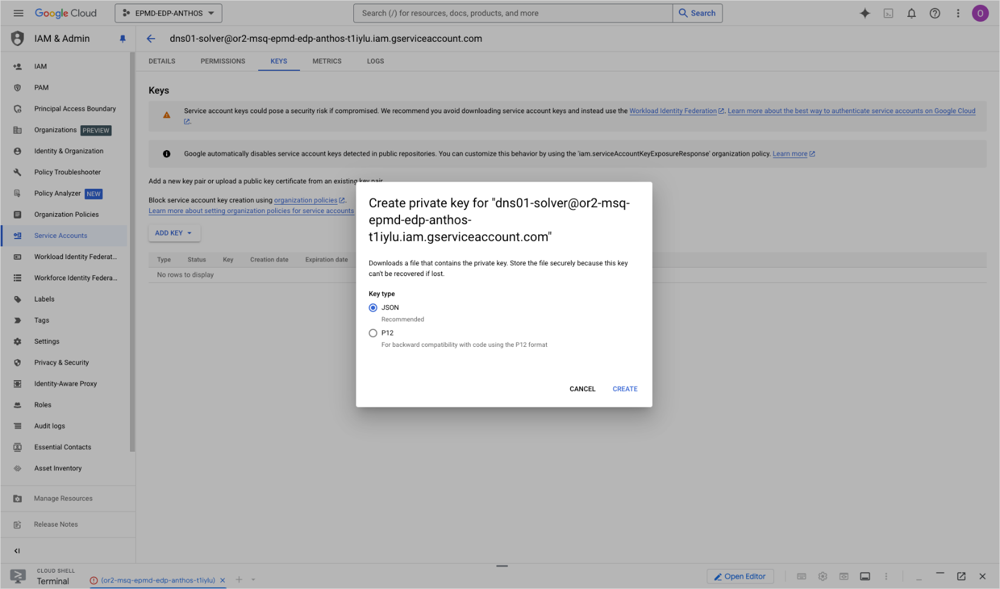

# Restore System Instructions

When experimenting with assistant configurations, the latest system instructions don't always produce the best results. AI/Run CodeMie automatically tracks all instruction changes, allowing you to restore any previous version.

## Access Instruction History

1. Navigate to **Assistants** → **Project Assistants**.

2. Click the **Actions** button (⋮) next to your assistant and select **Edit**:

   

3. Select the **History** tab:

   

## Restore Previous Version

1. Browse through saved versions and click the version title to preview.

2. Select the version you want to restore.

3. Click the **Restore** button:

   

:::info Version History
AI/Run CodeMie preserves all system instruction modifications, creating a complete audit trail. This allows you to safely experiment with different approaches while maintaining the ability to revert to proven configurations.
:::

:::tip Testing Iterations
Use version history to A/B test different instruction sets. Compare results from multiple versions to identify the most effective configuration for your use case.
:::
