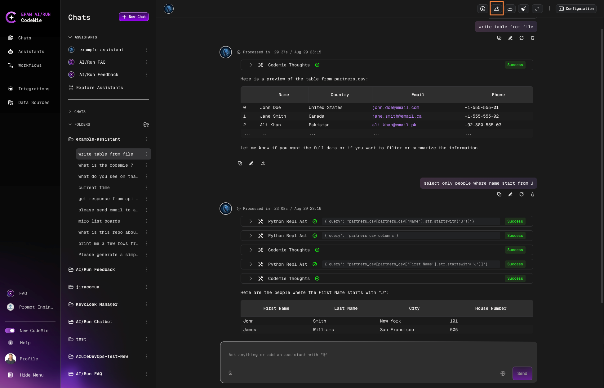
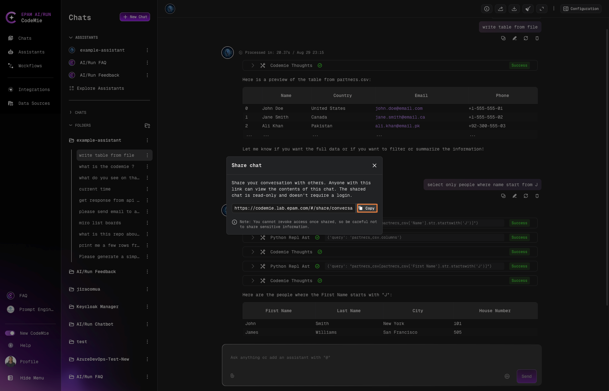

# Share Chat Conversations

Share assistant conversations with team members to collaborate on solutions, distribute insights, or provide reference material.

## Share a Chat

1. Open the chat you want to share.

2. Click the **Share Chat** button:

   

3. Copy the generated link:

   

4. Share the link with recipients.

## Read-Only Access

Recipients who open the shared link can:

- View the entire conversation history
- Read all messages and responses
- See uploaded files and attachments

Recipients cannot:

- Add new messages
- Modify existing content
- Delete the conversation

:::info Owner Control
As the chat creator, you retain full control. You can edit or delete the chat at any time through the context menu (⋮), even after sharing.
:::

## Manage Shared Chats

| Action         | Process                                 | Impact                                    |
| -------------- | --------------------------------------- | ----------------------------------------- |
| **Edit**       | Click context menu (⋮) → **Edit**       | Changes visible to all link holders       |
| **Delete**     | Click context menu (⋮) → **Delete**     | Removes access for everyone               |
| **Expiration** | None - links don't expire automatically | Access persists until you delete the chat |

## Use Cases

- **Team Collaboration**: Share problem-solving approaches and solutions
- **Code Distribution**: Distribute AI-generated code snippets to developers
- **Research Sharing**: Share analysis and findings with stakeholders
- **Documentation**: Create reference material for documentation or training
- **Demonstrations**: Show assistant capabilities to new team members
- **Knowledge Transfer**: Preserve and share successful interaction patterns

:::tip Security Consideration
Shared links provide read-only access to anyone who has the link. Only share conversations that don't contain sensitive information, or ensure the link is distributed through secure channels.
:::
