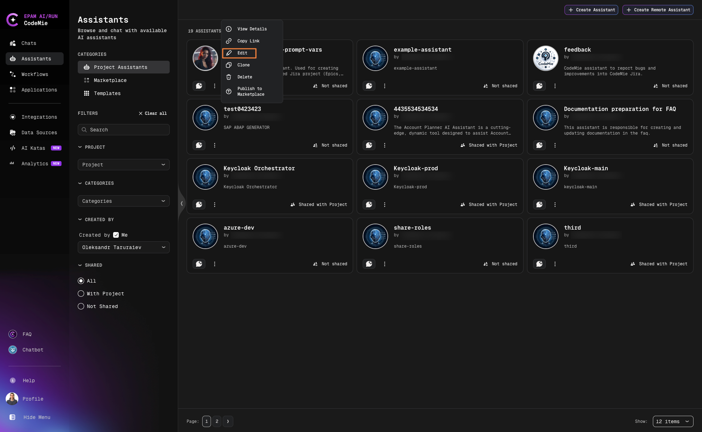

# Share Assistants

Finely tuned assistants are valuable resources that can benefit your entire team. AI/Run CodeMie provides flexible options for sharing assistants within projects and across your organization.

## Share Within Project

Share an assistant with your project team using the built-in toggle:

1. Navigate to **Assistants** → **Project Assistants**.

2. Click the **Actions** button (⋮) next to the assistant and select **Edit**:

   

3. Enable the **Shared with Project Team** option:

   

4. Scroll down and click **Save**.

:::tip Team Access
When shared with the project team, all team members can view and use the assistant in their chats while the original configuration remains under your control.
:::

## Share Beyond Projects

For sharing assistants across projects or with external collaborators, consider using the [Marketplace](./marketplace-overview) to publish your assistant configuration.
