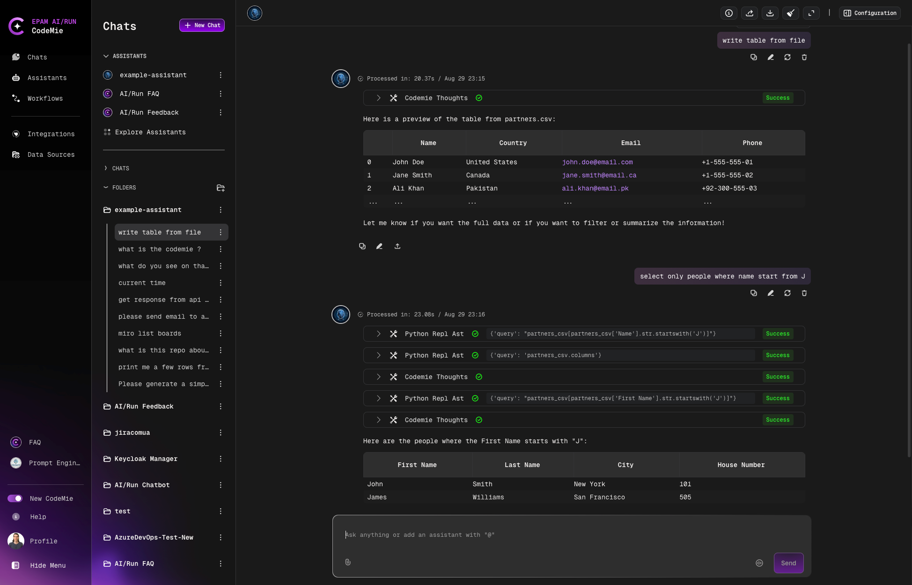

# Supported File Formats

Upload and analyze various file types in assistant conversations. AI/Run CodeMie supports multiple formats for different use cases.

## Supported Formats

| Format        | Extension                       | Use Case                                  |
| ------------- | ------------------------------- | ----------------------------------------- |
| **Images**    | `.jpeg`, `.jpg`, `.png`, `.gif` | Visual analysis, screenshots, diagrams    |
| **Documents** | `.pdf`, `.pptx`                 | Documentation, presentations, reports     |
| **Data**      | `.csv`                          | Tabular data, spreadsheets, data analysis |

**File Size Limit**: Maximum 100MB per file

## Working with Files

Upload files directly in the chat interface:

### CSV File Handling

Assistants can analyze CSV files and perform data operations:

- Display information in specific formats
- Filter data based on criteria
- Extract specific columns or rows
- Summarize data insights
- Generate visualizations from data

### File References

Once uploaded, files remain accessible throughout the chat conversation. You can reference previously uploaded files in subsequent messages without re-uploading.

:::tip Data Analysis
When uploading CSV files, provide context about the data structure and your analysis goals to get more accurate results from the assistant.
:::

:::info Persistence
Uploaded files are linked to the specific chat conversation. They will not be available in other chats unless re-uploaded.
:::
