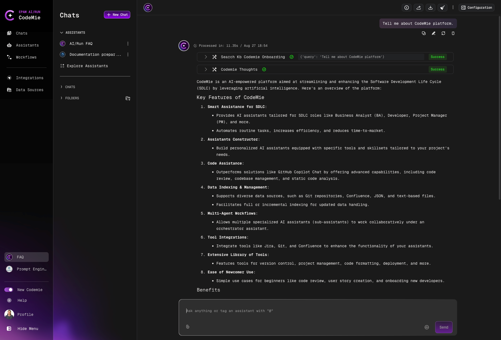

# 2.12 Administrative Tools Overview

In AI/Run CodeMie, admins have extended functionality that allows for regulating management issues. At the time being, Admin users can do the following things:

## Admin Capabilities

1. **Add new projects to AI/Run CodeMie** – adding new projects is a feature specific to administrative users only. To add a new project:
   - Log in to the AI/Run CodeMie with an administrative account
   - Navigate to AI/Run CodeMie -> **Profile Icon** -> **Settings** -> **Administration** -> **+ Create Project**:

   
   - Enter the project name and click **Add**:

   

   :::note
   Only lowercase letters, digits, and hyphen are allowed in the project naming.
   :::

2. **Observe all the assistants** – Admins can view all the assistants created within AI/Run CodeMie. You can easily explore them by navigating to **Assistants** -> **Project Assistants**:

   
