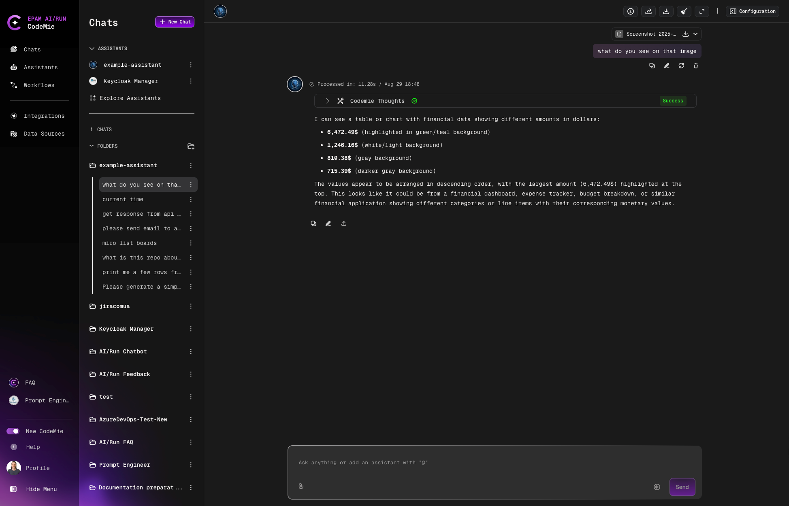

# 2.13 Processing Pictures

AI/Run CodeMie assistants can handle various image formats such as .jpg, .png, and .svg. They can analyze the contents, offer suggestions or improvements, and recognize images, among other capabilities.

## Adding Images to Chat

To insert pictures into the chat, simply click the **clip button** or use the image from the buffer (**Ctrl+V** or **Command+V**) to paste the image from the copy buffer into the chat input area.

Insert the image and ask the relevant question:

## Multiple Images

You can select up to 10 images for processing:

