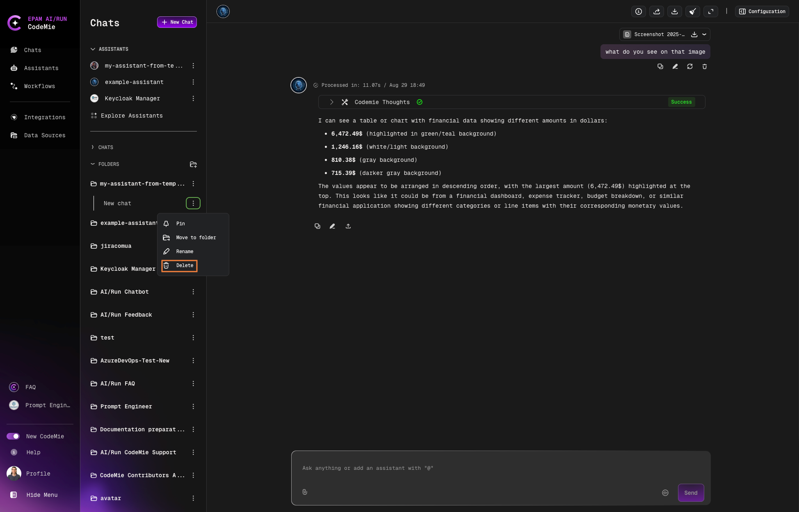
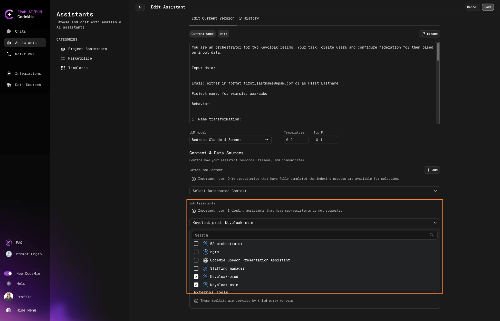

# 2.7 Integrations Overview

The Integrations menu allows users to integrate various tools for further usage when working with assistants. These tools will expand assistants' capabilities, allowing them not only to answer questions but also perform complex tasks, be it creating pull requests for a Git repository, updating Jira issues, collecting the fresh news from the news sites, etc.

There are two general types of integrations: User, User Global Integration and Project. They are distinguished by the availability level. If the user does not explicitly select an integration, the system will automatically choose a default integration based on the following priority:

- **User**: Personalized configurations that are applied only to the current user. These integrations allow individual users to customize their own experience and interaction with the software or platform according to their personal preferences and requirements.

- **User Global Integration**: A personal integration marked as global (i.e., available across all projects for the user). This type allows users to reuse the same integration in multiple contexts.

- **Project**: Any changes or adjustments made to the Project will affect all members who are part of the project. The purpose of Project is to ensure a consistent environment or set of rules for everyone involved.

:::note
This function is available for Admins roles only (Admin or Application Admin). Applications-admin can be requested by Support ticket.
:::

## Setting Up Integrations

1. In the AI/RunTM CodeMie main menu, click the **Integrations** tab:

   

2. In the Integrations menu, click **User** or **Project** and then click the **+ Create** button:

   

3. Select the desired tool and specify the credentials and click **+ Create**:

   

:::note
Most of the tools require you to specify the URL, token, and alias. Alias is the name of the setting that will be displayed in the integrations list.
:::

## Alternative Ways to Create Integrations

As an alternative way of getting to the Integrations page, you can click the **Add User Integration** button in front of the desired tool when creating/editing your assistant:

This link will also lead to the Create User Integration page. Note that this link appears only if no such tools are configured by the users.

If you have two or more integrations related to one tool, you can specify the needed one when adding/editing assistants:

## Creating Integration from Data Source Page

For Datasource you can create user integration from data source page:

1. Navigate or create a new datasource.

2. Click **Select integration** for.

3. Click the **Add User Integration** button.

   
   

4. After saving, the new integration appears in the existing list without requiring a page reload or navigation away.
