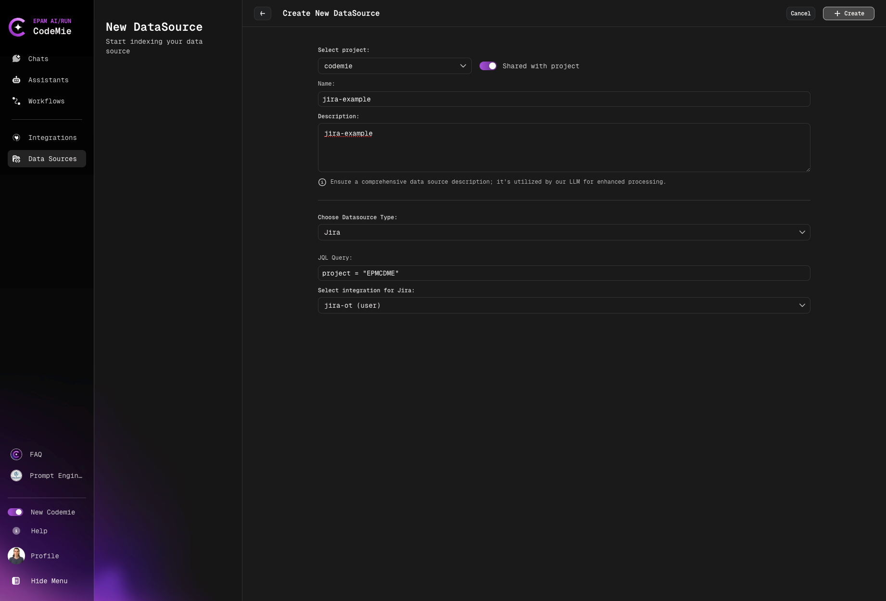
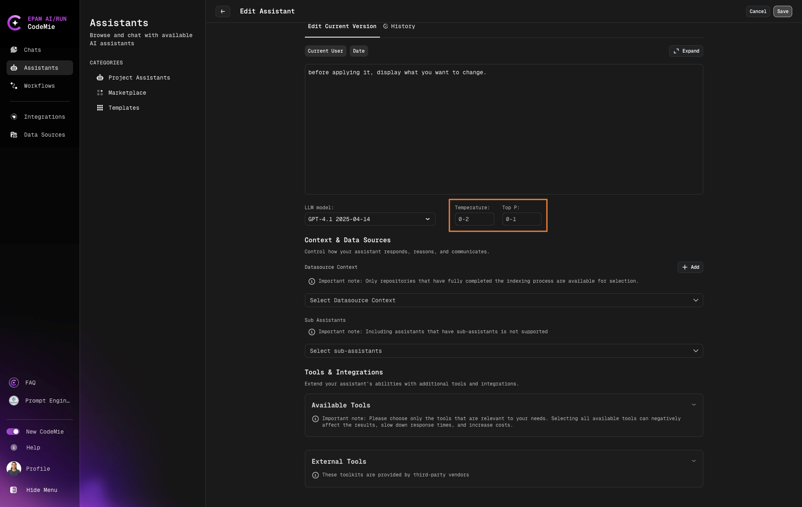

# 5.4 Improve Response Diversity

There are cases when you ask assistants to generate a response to answer a question. But the answer turns out to be not so informative. You ask the assistant to regenerate a response but each time it sends a similar response with rephrased text. As a result, an assistant seems incapable of resolving the issue.

We propose the "Temperature Scale" and "Top P" settings within the Assistant details page. These settings will provide users the ability to fine-tune the creativity, randomness, and response diversity of the Assistants based on their preferences and the specific LLM model in use.

## Response Parameters

1. **Top P**: Also known as nucleus sampling, Top P is a parameter used in natural language processing models. It controls the randomness of the model's predictions by setting a threshold for the probability distribution of the next word. The model will only consider the smallest set of words whose cumulative probability exceeds the Top P value. For instance, if Top P is set to 0.9, the model will only consider the top words that together have a 90% chance of being the next word.

2. **Temperature**: This is a parameter that controls the randomness of the model's predictions. A higher temperature will result in more random outputs, while a lower temperature will make the outputs more deterministic. For instance, a temperature of 0.1 will make the model's predictions very focused on the most likely next word, while a temperature of 2 will make the predictions more diverse and potentially more creative.

## Adjusting Response Randomness

To adjust response randomness, follow the steps below:

1. Navigate to **AI/Run CodeMie** -> **Assistants** tab.

2. Select the assistant you want to tune and click **Edit**:
   

3. Adjust **Temperature** and **Top P** to your desired level of control over the Assistant's response generation and click **Update**:
   

   :::note
   Please ensure that the Temperature value is set between 0 and 2, and the Top P value remains between 0 and 1. Setting values outside of these ranges may result in unexpected behavior or errors.
   :::

4. Test your updated assistant.
