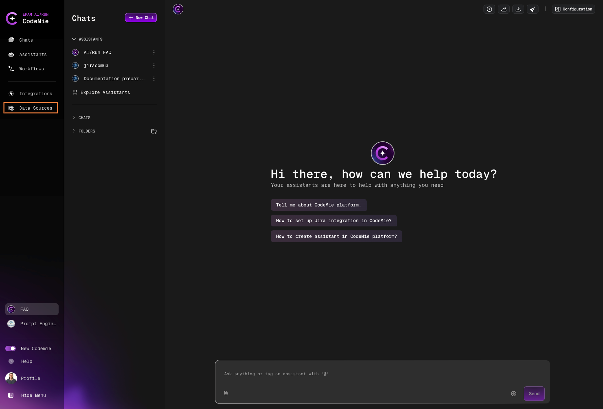
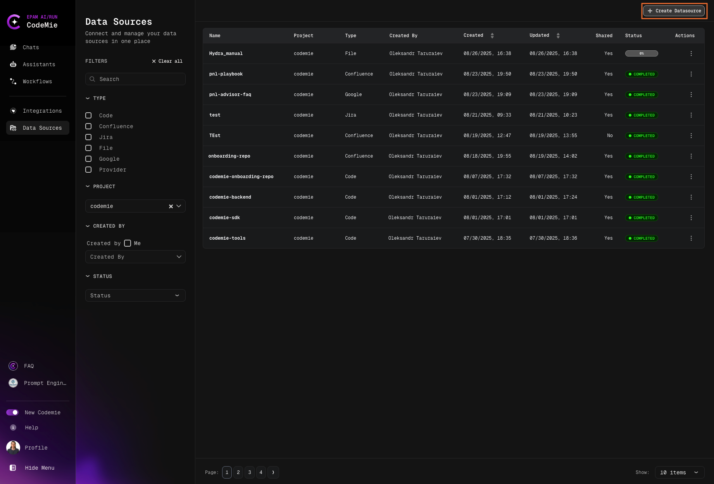
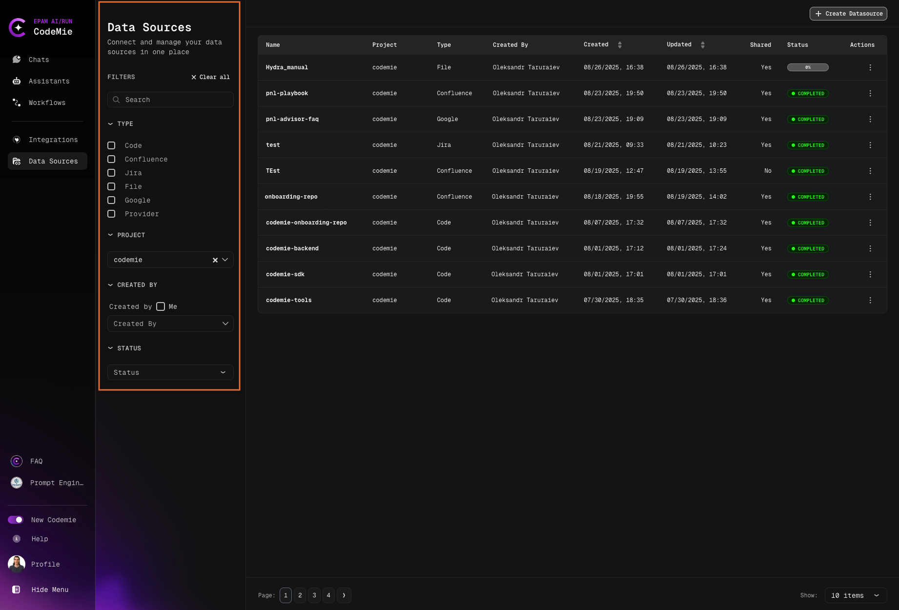

# Data Source Overview

Understanding data sources and their role in the platform.

The Data Source functionality in AI/Run CodeMie platform serves to incorporate various types of data into the platform, expanding the range of tasks the assistant can help with and enhancing its ability to provide relevant and accurate answers.

## Supported Data Source Types

You can add various types of Data Sources to AI/Run CodeMie platform, such as:

- **Code (Git)**: Git repositories for code analysis and development tasks
- **Confluence**: Confluence pages for documentation and knowledge base
- **Jira**: Jira spaces for project management and issue tracking
- **File**: Various file formats (Max size: 50MB)
  - Supported formats: `.yml`, `.yaml`, `.json`, `.pptx`, `.csv`, `.txt`, `.pdf`, `.docx`, `.xlsx`, `.xml`
- **Google Docs**: Google documents for collaborative documentation

:::info AWS Knowledge Bases
AI/Run CodeMie also supports AWS Knowledge Bases for enterprise-scale data indexing. Learn more in [Add AWS Knowledge Bases](../datasources-types/add-aws-knowledge-bases).
:::

## Adding a Data Source

To add a data source, follow these steps:

### 1. Navigate to Data Sources

Navigate to the **Data Sources** section:

### 2. Create New Data Source

Click the **+ Create Datasource** button:

### 3. Configure Data Source

In the **Add new data source** window, fill in the required fields:

#### Project

Select the code name of your project.

#### Data Source Name

Specify the relevant and distinctive name associated with the data source.

:::tip Naming Best Practices
Use lowercase letters, hyphens, and underscores only. Example: `customer-docs-2024`
:::

:::warning Data Source Naming Restrictions
Be aware about the following naming restrictions:

1. All letters must be lowercase
2. Only symbols `-`, `_` are allowed
3. It's not recommended to start Data Source Name with `_` (underscore) or `-` (hyphen)
4. Data Source Name can't contain spaces, commas, or the following characters: `"`, `*`, `:`, `+`, `/`, `\`, `|`, `?`, `#`, `>`, or `<`
5. Character limitations: Data source name must be between 4 and 25 characters
   :::

#### Description

Specify brief description that underlines data source features.

#### Shared with Project Team

Decide whether you want your project team members to use the data source or not.

#### Data Source Type

Specify data source type. It can be:

- Git repository
- Confluence page
- Jira space
- File (`.pdf`, `.txt`, `.csv`, `.pptx`, `.xml`, `.json`, `.yaml`)
- Google document

## Filtering Data Sources

As you work with CodeMie, the number of data sources will increase. To simplify navigation between data sources, use the **filters**. You can filter datasources by:

- **NAME**: Filter by data source name
- **TYPE**: Filter by data source type (Git, Confluence, Jira, File, Google Docs)
- **PROJECT**: Filter by project
- **CREATED BY**: Filter by creator
- **STATUS**: Filter by indexing status

## Data Source Visibility

Indexed repositories within the project space are visible to all members of the assigned project but not to the users assigned to other projects. The **Shared with Project Team** option determines whether this data source will be available to all project participants or will be private – visible only to the user who created it. By default, the data source will be available to all project participants.

:::warning Privacy Note
Private data sources are only visible to their creator. Ensure you share critical data sources with your team by enabling "Shared with Project Team".
:::

## Best Practices

### Data Source Naming

- Use descriptive, meaningful names
- Follow lowercase convention
- Use hyphens or underscores for word separation
- Keep names concise (4-25 characters)

### Data Source Organization

- Use consistent naming conventions across your project
- Add clear descriptions to help team members understand the purpose
- Regularly review and clean up unused data sources
- Use filters to organize and find data sources quickly

### Data Source Management

- Share data sources with the team when appropriate
- Keep data sources up-to-date with regular reindexing
- Monitor indexing status to ensure data is current
- Document data source purposes in descriptions

## Use Cases

Data sources enable various use cases:

- **Code Analysis**: Index Git repositories for code review and analysis
- **Documentation Search**: Index Confluence pages for quick documentation access
- **Issue Tracking**: Index Jira spaces for issue and project management
- **File Processing**: Index documents for content analysis and extraction
- **Knowledge Management**: Combine multiple data sources for comprehensive knowledge base

## Next Steps

After creating data sources, you can:

- [Index data sources](./indexing-data-sources) to make them available to assistants
- [Configure assistants](../../assistants/) to use specific data sources
- [Set up integrations](../../integrations/) for external services
- [Create workflows](../../workflows/) that leverage multiple data sources

:::tip
The quality of assistant responses directly correlates with the quality and comprehensiveness of indexed data sources. Ensure your data sources are well-organized and regularly updated for optimal results.
:::

Now you're ready to add and manage data sources in AI/Run CodeMie to enhance your assistant capabilities.
