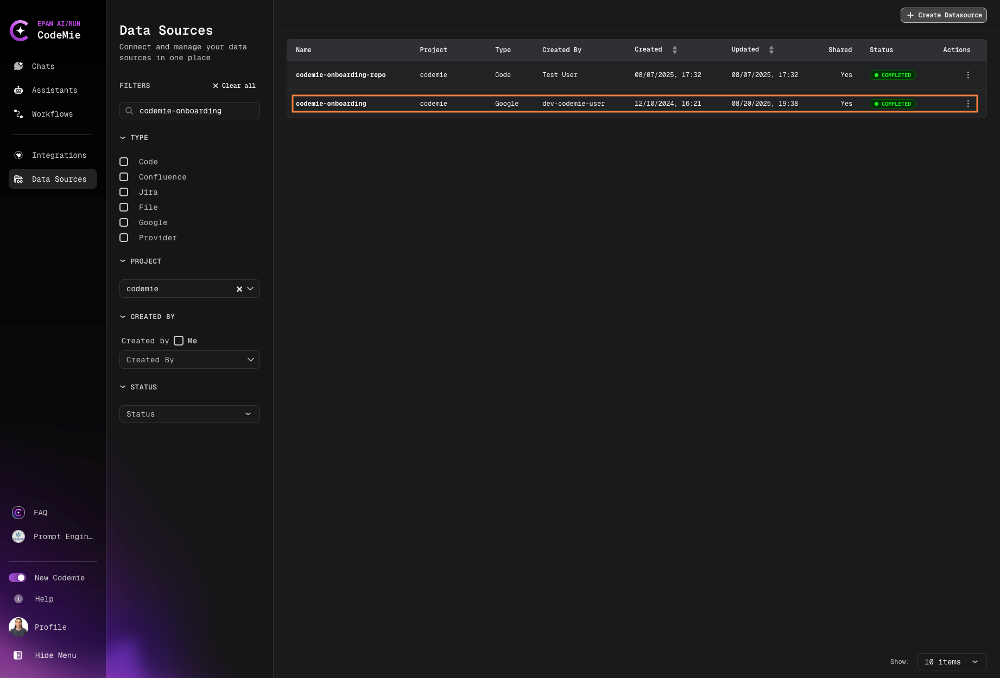
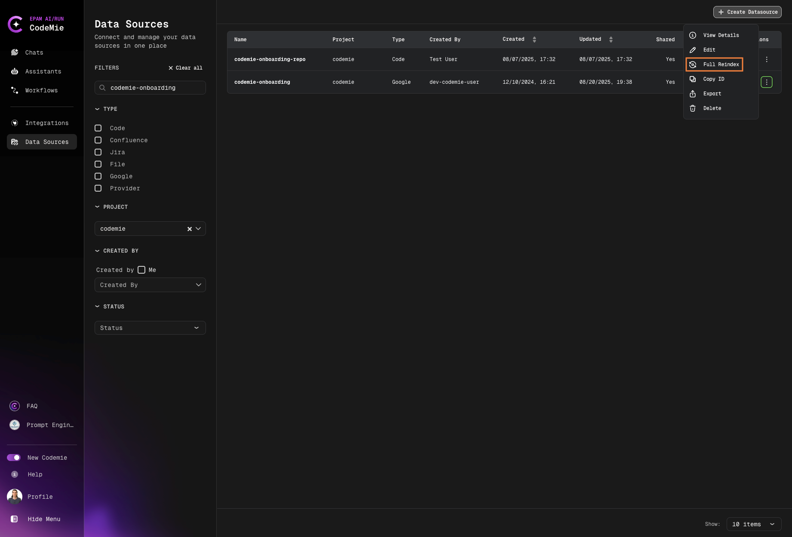
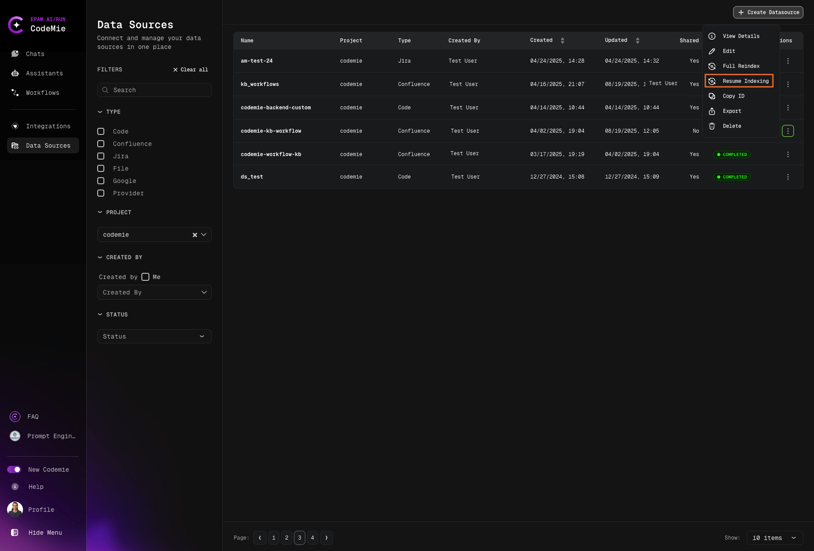

# Indexing Data Sources

Learn how to index data sources for better searchability and access.

Once a data source is added to the AI/Run CodeMie platform, you can proceed with indexing it. Indexing enables assistants and workflows to interact with the data within the data source. Assistants can only access data that has been indexed, so you need to re-index the data source each time it is updated. Otherwise, AI/Run CodeMie will not recognize the new data.

## Automatic Indexing

By default, AI/Run CodeMie automatically indexes new data sources as soon as they are added to the platform:

:::info
You don't have to wait till a data source is fully indexed. You can already add this data source into your assistants.
:::

:::warning Partial Data Access
If you add a data source before indexing completes, assistants will only access already-indexed content. Wait for full indexing for complete coverage.
:::

## Manual Reindexing

To manually trigger data source reindexing, click the actions button and select **Full Reindex** or **Incremental Index**:

### Indexing Types

#### Full Reindex

A complete reindexing of the data source. This involves scanning and updating all data from the source, regardless of any changes.

**When to use Full Reindex:**

- After major updates to the data source
- When data integrity issues are suspected
- For initial indexing of large data sources
- When switching indexing strategies or configurations

#### Incremental Index

This option is currently only supported for Jira data sources. With this option only new or changed data from the source will be updated. It only reindexes the data that has been modified since the last reindex.

**When to use Incremental Index:**

- For frequent, small updates to Jira data sources
- To save time and resources on large Jira projects
- For regular synchronization of Jira issues
- When only recent changes need to be reflected

:::tip Jira-Specific Feature
Incremental indexing is currently only available for Jira. Other data sources require full reindexing. We're working on expanding this feature.
:::

:::note Alternative Access
Full reindex is also available on **Data Source Details** page: Data Source tab → Selected data source → 3 dots → View → scroll the page to the bottom
:::

## Resuming Indexing

If indexing is interrupted or paused, you can resume the process by clicking the **Resume Indexing** button:

## Indexing Best Practices

### Regular Reindexing Schedule

- **Git Repositories**: Reindex after major commits or releases
- **Confluence**: Reindex when documentation is updated
- **Jira**: Use incremental indexing for daily updates, full reindex weekly or monthly
- **Files**: Reindex when files are modified or replaced
- **Google Docs**: Reindex after document updates

:::info Automation Coming Soon
Automatic reindexing on data source changes is planned for future releases. Currently, all reindexing must be triggered manually.
:::

### Monitoring Indexing Status

Keep track of your data source indexing status:

- Check the **STATUS** column in the data sources list
- Monitor indexing progress for large data sources
- Verify successful completion of indexing operations
- Review any indexing errors or warnings

### Optimizing Indexing Performance

- **Schedule Large Reindexes**: Perform full reindexes during off-peak hours
- **Use Incremental Indexing**: Leverage incremental indexing for Jira when possible
- **Batch Updates**: Group multiple changes before triggering reindex
- **Clean Up First**: Remove outdated or unnecessary data before reindexing

:::danger Data Loss Warning
Full reindex replaces all existing indexed data. If your data source has changed significantly (e.g., repository deleted, Confluence pages removed), those items will be removed from search results.
:::

## Indexing Status Indicators

Data sources display different statuses during the indexing process:

- **Indexing**: Currently being indexed
- **Indexed**: Successfully indexed and ready to use
- **Failed**: Indexing encountered an error
- **Pending**: Waiting to start indexing
- **Paused**: Indexing process is paused

Now your data sources are indexed and ready to be used by assistants and workflows for enhanced AI-powered operations.
